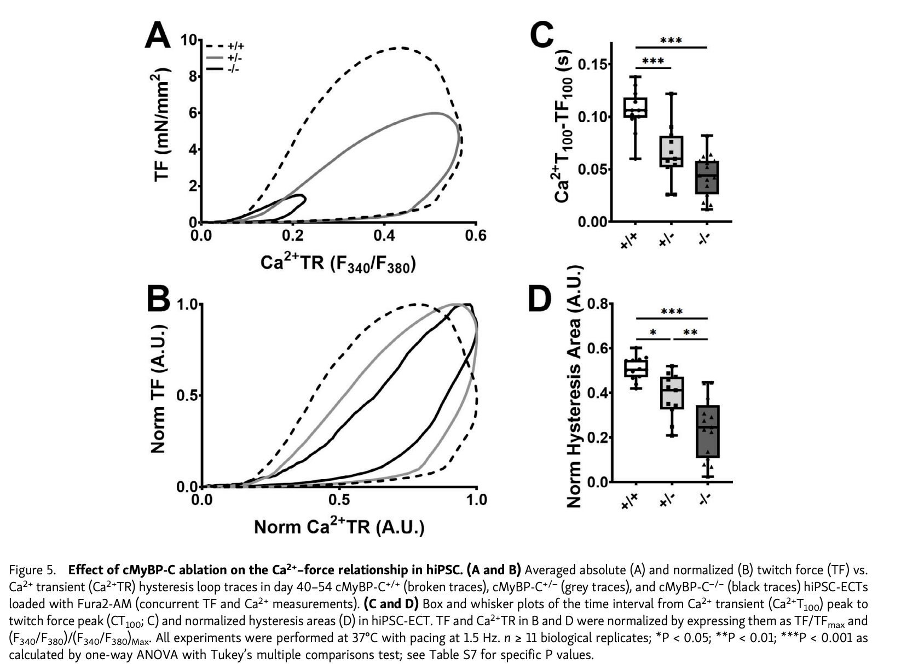

# Introduction

This dataset was collected to explore the impact of heterozygous (cMyBP-C+/-) and homozygous (cMyBP-C-/-) truncation mutations in the cardiac myosin binding protein C (cMyBP-C) gene on hypertrophic cardiomyopathy (HCM) using human induced pluripotent stem cells (hiPSCs). Utilizing CRISPR-Cas9 technology, researchers generated iPSC-derived cardiomyocytes and engineered cardiac tissue constructs (ECTs) to study contractile function, calcium handling, and calcium sensitivity. The investigation revealed that cMyBP-C mutations lead to progressive calcium-handling abnormalities and contractile dysfunction, providing insights into the molecular mechanisms underlying HCM [@de2023cmybp].

The figure below is obtained from Figure 5 of the author's publication. It illustrates the relationship between calcium dynamics and muscle contraction in heart cells with different cMyBP-C alleles. The broken traces represent cMyBP-C+/+ hiPSC-ECTs, grey traces represent cMyBP-C+/- hiPSC-ECTs, and black traces correspond to cMyBP-C-/- hiPSC-ECTs. The result indicates that mutations in cMyBP-C lead to faster calcium transitions and decreased force generation, with the most significant changes occuring in the homozygous mutant (cMyBP-C-/-) hiPS-ECTs, suggesting a heightened sensitivity to calcium in these cells [@de2023cmybp].



**Why is this dataset of interest to you?**
I am currently working on a research project exploring the effect of circMYBPC3 expression on cardiac fibroblast proliferation. We found an increase proliferation rate in overexpressed circMYBPC3 cells. This leads to the clinical presentation of HCM, where HCM patients also reported an increase in circMYBPC3 RNA levels. Thus, I am interested in the other effects that the gene encoding for circMYBPC3 plays in the progression of HCM. This study and dataset perfectly covers for that, as they look at the cMyBP knockouts and its effect towards processes involved in cardiac physiology and HCM.

**What are the control and test conditions of the dataset?**
The control is the homozygous wild-type cMyBP hiPSC-ECTs (cMyBP-C+/+)
The test conditions are the heterozygous (cMyBP-C+/-) and homozygous (cMyBP-C-/-) truncation mutated hiPSC-ECTs.

# Preparing Data and Initial Cleaning
We can start by importing the following packages from r: GEOquery [@davis2007geoquery], knitr [@xie2017dynamic], dplyr [@wickham2014dplyr], and edgeR [@robinson2010edger].
```{r, echo=FALSE, message=FALSE, warning=FALSE}
library(GEOquery)
library(knitr)
library(dplyr)
library(edgeR)
```

The data was obtained from the GEO accession number: GSE224129. The supplementary file associated with that GEO number contains the gene expression raw counts which we will use throughout the subsequent analysis.
```{r results='hide', error=FALSE, message=FALSE, warning=FALSE}
#Getting the GEO accession data
data_set_geoid <- "GSE224129"
gse <- getGEO(data_set_geoid, GSEMatrix=FALSE)

#getting the names of the supplementary files
sfilenames = getGEOSuppFiles(data_set_geoid, fetch_files = FALSE)
data_filename <- sfilenames$fname[1]
```

Download the expression data if it has not been downloaded yet
```{r}
#location to download and store files
download_dir <- file.path(getwd())

#check to see if the file exists already before you download them
#only download files that we don't have from the set of supplementary files
missing_files <- sfilenames$fname[!unlist(lapply(sfilenames$fname, FUN=function(x) {
  file.exists((
    file.path(download_dir, data_set_geoid, x)))}))]

if(length(missing_files) > 0){
  for(i in 1:length(missing_files)){
    #get the supplementary files
    sfiles = getGEOSuppFiles(data_set_geoid, filter_regex = missing_files[i], baseDir = download_dir, fetch_files = TRUE)
  }
}
```

We can see how many genes and total samples are present initially in the files as follows
```{r}
homo_hetero_wt_data <- read.table (
  file.path(download_dir, data_set_geoid, data_filename), header = TRUE, check.names = TRUE)

dim(homo_hetero_wt_data)
```

Here's what the original data looks like
```{r}
head(homo_hetero_wt_data, format = "html")
```

In the GEO website, it mentions that the column names indicate the different samples and their genotype. We can then reorder and rename the column so that the different conditions are easily comparable
```{r, echo=FALSE}
# Reorder columns
# Get the current order of columns
current_order <- names(homo_hetero_wt_data)

# Define the new position for "X2.002081E7", which is right after "X2.0020811E7"
position_to_move_after <- which(current_order == "X2.0020811E7")

# Check if the column "X2.002081E7" exists in the dataframe
if("X2.002081E7" %in% current_order) {
  # Remove "X2.002081E7" from its current position
  current_order <- current_order[current_order != "X2.002081E7"]
  
  # Insert "X2.002081E7" after "X2.0020811E7"
  new_order <- append(current_order, "X2.002081E7", after = position_to_move_after)
  
  # Reorder the dataframe columns
  homo_hetero_wt_data <- homo_hetero_wt_data[, new_order]
} else {
  stop("Column 'X2.002081E7' does not exist in the dataframe.")
}

renamed_col <- colnames(homo_hetero_wt_data) <- c("homo mutant 1", "homo mutant 2", "homo mutant 3", "homo mutant 4", "hetero mutant 1", "hetero mutant 2", "hetero mutant 3", "hetero mutant 4", "wild type 1", "wild type 2", "wild type 3", "wild type 4")

head(homo_hetero_wt_data)
```

# Assessing Data
## Statistical Overview
Before we modify the data, we can first look at the statistical overview of the data. Here, we'll be performing an analysis of the minimal value, median, maximal value, first quartile, and third quartile for all the samples.

```{r}
# Assign column names to each group for easy reference
colnames(homo_hetero_wt_data) <- c("homo_mutant_1", "homo_mutant_2", "homo_mutant_3", "homo_mutant_4",
                                   "hetero_mutant_1", "hetero_mutant_2", "hetero_mutant_3", "hetero_mutant_4",
                                   "wild_type_1", "wild_type_2", "wild_type_3", "wild_type_4")

# Subset data into three conditions
homo_data <- homo_hetero_wt_data[, 1:4]
hetero_data <- homo_hetero_wt_data[, 5:8]
wt_data <- homo_hetero_wt_data[, 9:12]

# Define the function to calculate the statistics
calc_stats <- function(data) {
  data.frame(
    min = apply(data, 2, min, na.rm = TRUE),
    Q1 = apply(data, 2, quantile, probs = 0.25, na.rm = TRUE),
    median = apply(data, 2, median, na.rm = TRUE),
    mean = apply(data, 2, mean, na.rm = TRUE),
    Q3 = apply(data, 2, quantile, probs = 0.75, na.rm = TRUE),
    max = apply(data, 2, max, na.rm = TRUE)
  )
}

# Subset data into three conditions
homo_data <- homo_hetero_wt_data[, 1:4]
hetero_data <- homo_hetero_wt_data[, 5:8]
wt_data <- homo_hetero_wt_data[, 9:12]

# Calculate statistics for each condition
homo_stats <- calc_stats(homo_data)
hetero_stats <- calc_stats(hetero_data)
wt_stats <- calc_stats(wt_data)

# Combine the statistics into a single data frame for presentation
overview_stats <- rbind(homo_stats, hetero_stats, wt_stats)

# Print the overview statistics
print(overview_stats)
```
Looking at the statistics above, it seems that the median and the first quartile (Q1) values for all samples are zero, which could indicate a large number of zero values or possibly a skewed distribution with many low values in their dataset. Furthermore, the mean values are relatively high compared to the medians, suggesting a right-skewed distribution. As such, the data should be cleaned to have a better visualization. This includes removing the zeros as we'll perform soon.

## Biological Overview
We can also perform another assessment on the samples from a more biological perspective. Specifically, we can look at the tissue types, cell lines, cell types, genotype, treatments, and the sex of the originating individual for all the samples.
```{r}
list_of_samples <- gse@gsms

samples_type <- do.call(rbind, 
                       lapply(list_of_samples, 
                              FUN=function(x) {
                                c(x@header$title,
                                  x@header$characteristics_ch1)
                                  }
                              )
                       )

colnames(samples_type) <- c("title", "tissue", "cell line", "cell type", "genotype", "treatment", "sex")

samples_type[, 'tissue'] <- gsub(samples_type[, 'tissue'], pattern = "tissue: ", replacement = "")
samples_type[, 'cell line'] <- gsub(samples_type[, 'cell line'], pattern = "cell line: ", replacement = "")
samples_type[, 'cell type'] <- gsub(samples_type[, 'cell type'], pattern = "cell type: ", replacement = "")
samples_type[, 'genotype'] <- gsub(samples_type[, 'genotype'], pattern = "genotype: ", replacement = "")
samples_type[, 'treatment'] <- gsub(samples_type[, 'treatment'], pattern = "treatment: ", replacement = "")
samples_type[, 'sex'] <- gsub(samples_type[, 'sex'], pattern = "sex: ", replacement = "")

kable(samples_type[1:12, ], format = "html")
```

Looking at the data assessment above, it appeared that all the cells are engineered cardiac cells, which are iPSC-drived cardiomyocyte and cardiac fibroblast. This makes sense as those two cell types are the most common cell types present in the heart. They are derived from the DF19-0-11T.H cell lines, which are foreskin fibroblast, which are stem cells that can be induced to other cell types, including cardiomyocyte and cardiac fibroblast as used here [@yu2009human]. 

The different sample conditions can be nicely categorized into the following table, including the count as the number of samples in each condition.
```{r, echo=FALSE, message=FALSE, warning=FALSE}
sample_type_dt <- data.table::data.table(samples_type)

sample_type_dt[, .(count = .N), by = sample_type_dt$genotype]
```

# Cleaning the Data
Before we continue with our analysis and preparation of the data, we would want to clean the data. One of the main component in cleaning the data involves removing those genes that has 0 counts. Earlier, we saw that our data does include quite a few of genes that has 0 counts on them. Hence, the 0 Q1 and median values for all the samples. 

The following chunk of code will eliminate those low counts:
```{r}
#minimal number of samples
min_num_samples <- 4

data_matrix <- as.matrix(homo_hetero_wt_data)

#get rid of low counts
keep = rowSums(cpm(data_matrix) >1) > min_num_samples
filtered_data_matrix = data_matrix[keep,]
head(filtered_data_matrix)
```
Another key step in this section is to remove any outliers or any samples that the author did not use. However, the author's publication did not mention any existence of an outlier, extreme values or anomalies. They also used all twelve of their samples. Thus, we did not further remove any of the data.

# Mapping the Data
In the raw counts data provided by the authors, they use the Ensembl gene IDs to identify the genes. However, we would like to map these IDs to the HUGO symbols, specifically to the HGNC symbols. 

```{r}
ids2convert <- rownames(filtered_data_matrix)

#check to see if id_conversion file exists (computationally intensive)
conversion_stash <- "id_conversion.rds"
if(file.exists(conversion_stash)){
  id_conversion <- readRDS(conversion_stash)
}  else {
   id_conversion <- getBM(attributes = 
c("ensembl_gene_id","hgnc_symbol"),
                            filters = c("ensembl_gene_id"),
                            values = ids2convert,
                            mart = ensembl)
   saveRDS(id_conversion, conversion_stash)
}
```

Here are the number of genes that we were able to map:
```{r}
length(which(rownames(filtered_data_matrix) %in%
               id_conversion$ensembl_gene_id))
```

Out of our total ensembl genes that we started with:
```{r}
nrow(filtered_data_matrix)
```

And here is the difference between them. In other words, this is the number of genes without a valid Ensembl gene ID.
```{r}
nrow(filtered_data_matrix) - length(which(rownames(filtered_data_matrix)
                                  %in% 
                                    id_conversion$ensembl_gene_id))
```
This low value indicates that a good amount of our genes were able to be mapped to the HGNC symbols. We can ignore the unmapped genes.

Before we merge the HGNC symbols to our data, we also want to check for the number of genes with a valid Ensembl gene ID but has no HGNC symbol. These genes are those with N/A listed as the HGNC symbols.

```{r}
sum(id_conversion$hgnc_symbol == "")
```

Next, we want to isolate only those genes with a valid HGNC symbol to be used when merging with our dataset.
```{r}
id_conversion <- id_conversion[id_conversion$hgnc_symbol != "", ]
```

We can also look to see if there are any genes that are duplicated in the dataset. Here, we found one gene to be duplicated "GUSBP11"
```{r}
# Find duplicate HGNC symbols
hgnc_symbol_duplicate <- id_conversion$hgnc_symbol[duplicated(id_conversion$hgnc_symbol)]
print(hgnc_symbol_duplicate)
```

Finally, we can merge the hgnc symbols with the dataset using the following code:
```{r}
# Remove rows with NA hgnc_symbol
filtered_data_without_NA <- id_conversion[!is.na(id_conversion$hgnc_symbol), ]

# Merge filtered_data_without_NA with filtered_data_matrix
merged_data <- merge(filtered_data_without_NA, filtered_data_matrix, by.x = "ensembl_gene_id", by.y = "row.names", all.x = TRUE)

# Identify and remove duplicate rows based on hgnc_symbol, keeping the first occurrence (removing the "GUSPB11" duplicate)
merged_data <- merged_data[!duplicated(merged_data$hgnc_symbol), ]
```

The final amount of valid and non-duplicated genes with a valid hgnc symbol are as follows:
```{r}
nrow(merged_data)
```
Therefore, among the 13249 total Ensembl genes we started with, after removing 79 genes that we're unable to map, another 464 genes with N/A listed as their hgnc symbol, and 1 duplicate, we are left with the 12705 genes that we'll use for normalization in the following section.

However, before doing the normalization, we can set the HGNC symbols as row names.
```{r}
# Set the HGNC symbols as rownames
rownames(merged_data) <- merged_data$hgnc_symbol

# Remove the HGNC symbol column as it is now the rowname
merged_data <- merged_data[, !colnames(merged_data) %in% c("hgnc_symbol", "ensembl_gene_id")]

# See the merged data
head(merged_data)
```

# Normalization
We'll perform both pre and post-normalization analysis to visualize the effect of normalization to our dataset.

## Pre-normalization 
Before normalizing the data, we can visualize the distribution of the data using a boxplot and also look at its density distribution. Here's the figure for the raw, unnormalized counts.

```{r, echo=FALSE, message=FALSE, warning=FALSE}
# Create the boxplot
boxplot(homo_hetero_wt_data, xlab = "samples", ylab = "log2 TPM",
        las = 2, cex = 0.5, cex.lab = 0.5,
        cex.axis = 0.5, main = "Pre-Normalized Raw Counts RNASeq Samples")

# Draw the median on each box plot
medians <- apply(homo_hetero_wt_data, 2, median)
abline(h = medians, col = "green", lwd = 0.6, lty = "dashed")

raw_density <- apply(log2(homo_hetero_wt_data), 2, density)

#calculate the limits across all the samples
xlim <- 0; ylim <- 0
for (i in 1:length(raw_density)) {
    xlim <- range(c(xlim, raw_density[[i]]$x));
    ylim <- range(c(ylim, raw_density[[i]]$y))
}

cols <- rainbow(length(raw_density))
ltys <- rep(1, length(raw_density))

#plot the first density plot to initialize the plot
plot(raw_density[[1]], xlim=xlim, ylim=ylim, type="n",
     ylab="smoothing density of log2-CPM",
     main="Pre-Normalized Raw Counts Density Plot", cex.lab = 0.85)
#plot each line
for (i in 1:length(raw_density))
    lines(raw_density[[i]], col=cols[i], lty=ltys[i])

#create legend
legend("topright", colnames(merged_data),
       col=cols, lty=ltys, cex=0.75,
       border="blue", text.col = "green4",
       merge = TRUE, bg = "gray90")
```

Immediately, you can see that this pre-normalization figures is not really nice. The boxplot shows a lot of data around the 0 in the raw counts that we obtained from the supplementary files given in GEO. The density plot also shows quite a large bandwidth that appeared bimodal in shape. 

## Post-normalization
Now, we can see how the data clean-up and normalization will effect our plots. The normalization method we'll use is Trimmed Mean of M-values (TMM). This method is used based on the hypothesis that most genes are not differentially expressed.

```{r}
# Convert the data frame to a matrix
merged_matrix <- as.matrix(merged_data)

# Create an edgeR container for RNAseq count data
d = DGEList(counts=merged_matrix, group=sample_type_dt$genotype)

# Calculate the normalization factors
d = calcNormFactors(d)

normalized_counts <- cpm(d)
```

Next, we'll visualize the distribution of our normalized data and its density as we did previously with the pre-normalized data. 
```{r, echo=FALSE, message=FALSE, warning=FALSE}
# Add a small constant before log transformation to avoid log(0)
data2plot <- log2(normalized_counts + 0.01)

# Create the boxplot
boxplot(data2plot, xlab = "samples", ylab = "log2 TPM",
        las = 2, cex = 0.5, cex.lab = 0.5,
        cex.axis = 0.5, main = "Post-Normalization RNASeq Samples")

# Draw the median on each box plot
medians <- apply(data2plot, 2, median)
abline(h = medians, col = "green", lwd = 0.6, lty = "dashed")

counts_density <- apply(log2(normalized_counts + 0.01), 2, density)

#calculate the limits across all the samples
xlim <- 0; ylim <- 0
for (i in 1:length(counts_density)) {
    xlim <- range(c(xlim, counts_density[[i]]$x));
    ylim <- range(c(ylim, counts_density[[i]]$y))
}

cols <- rainbow(length(counts_density))
ltys <- rep(1, length(counts_density))

#plot the first density plot to initialize the plot
plot(counts_density[[1]], xlim=xlim, ylim=ylim, type="n",
     ylab="smoothing density of log2-CPM",
     main="Post-Normalization Density Plot", cex.lab = 0.85)
#plot each line
for (i in 1:length(counts_density))
    lines(counts_density[[i]], col=cols[i], lty=ltys[i])

#create legend
legend("topright", colnames(data2plot),
       col=cols, lty=ltys, cex=0.75,
       border="blue", text.col = "green4",
       merge = TRUE, bg = "gray90")
```

Immediately, you can see the effect of filtering towards the data. The box plot appeared nicer with a defined box and median, Q1 and Q3 ranges. Additionally, it removes the peak around 0 in the density plot and the remaining peak have a slight shift in the center compared to the pre-normalization plots, which might be expected due to the nature of TMM normalization, as adjusts the counts to make the samples more comparable. 

While it appeared that the overall density plot appeared more compact, it might be mostly due to the filtering process rather than the normalization. In other words, the overall shape of the density plots remains similar pre and post-normalization, where the TMM normalization does not drastically alter the distribution of counts across samples. This might actually be a desired outcome, where the variability seen in the pre-normalized data is mainly due to true biological differences rather than technical artifacts and TMM normalization will not necessarily reduce it.

# MDS plot
To look at the level of similarity and clustering of the samples, we can use a multidimensional scaling (MDS) plot.
```{r}
limma::plotMDS(d, labels=NULL,pch=1, main = "MDS Analysis of Gene Expression Profiles by cMyBP-C Genotype",
  col = c("red", "orange", "purple") [factor(sample_type_dt$genotype)])

legend("topright",
       legend=levels(factor(sample_type_dt$genotype)),
       pch=c(1), col=
c("red", "orange", "purple"),title="class",
       bty = 'n', cex=0.75)
```

Looking at the figure above, it appears that there is a clustering pattern where samples of the same class are generally closer to each other. However, the separation is not very distinct, especially between the cMyBP-C+/+ and cMyBP-C+/− classes, which overlap considerably. The cMyBP-C−/− class seems to be more distinct, indicating that this group might have a more significant difference in the data characteristics measured compared to the other two groups.

Thus, the heterozygous genotype may not a huge differential expression profile from the homozygous wild type. Meanwhile, the separation of the homozygous mutant may indicate a significant differential expression profile, which aligns with what the authors report. 

# Final Coverage
We can compare the number of final included genes with the initial number of genes in the original data.

Here is the number of genes and counts in our normalized data
```{r}
a <- nrow(normalized_counts)
a
```

Here is the number of genes and counts in our originial data
```{r}
b <- nrow(homo_hetero_wt_data)
b
```

Thus, the coverage can be calculated as follows
```{r}
a/b*100
```
The final coverage of our dataset is 21.8%.

# Normalized and HUGO Mapped Dataset
Below is an overview of the finalized, prepared, normalized and hgnc symbol mapped dataset.
```{r}
head(normalized_counts)
```


# Interpretation and Documentation
**Why is the dataset of interest to you?**
[Introduction](#introduction)

**What are the control and test conditions of the dataset?**
[Introduction](#introduction)

**How many samples in each of the conditions of your dataset?**
There are 12 samples in total, 4 for each genotype (cMyBP-C+/+, cMyBP-C+/-, and cMyBP-C-/-). [Biological Overview](#biological-overview)

**Were there expression values that were not unique for specific genes? How did you handle these?**
Yes, there are 79 genes in our dataset without a valid Ensembl gene ID. Since they only account for a small portion of our dataset, we removed those genes.[Mapping the Data](#mapping-the-data)

**Were there expression values that could not be mapped to current HUGO symbols?**
Yes, we found 464 had N/A listed as the HGNC symbols. Hence, they could not be mapped to the current HUGO symbols. We also removed those genes as they only account for a small portion of our dataset. [Mapping the Data](#mapping-the-data)

**Were there any outliers in your dataset? How were they handled in the originating paper? How many outliers were removed?**
There are no outliers in our dataset. The paper also did not mentioned any presence of an outliers. Thus, when cleaning the data, we simply select those genes with a count greater than 0. They also used all 12 of their samples. [Cleaning the Data](#cleaning-the-data)

**How did you handle replicates?**
We found a replicate where two genes using the Ensembl gene ID that maps to the same HGNC symbol, "GUSBP11". We remove one of the replicates, specifically the second one, which has a very low expression value (low counts). [Mapping the Data](#mapping-the-data)

**What is the final coverage of your dataset?**
The final coverage of our dataset is 21.8%. [Final Coverage](#final-coverage)


# References


