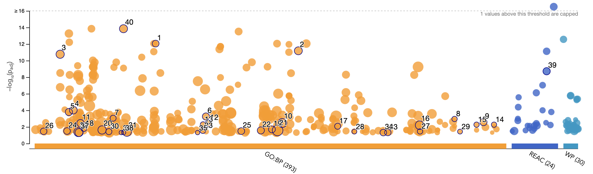

# Introduction
The dataset used in this study will be from a study performed by DeLange et al., 2023. The dataset is titled "transcriptomic profileing of iPSC-derived engineered cardiac tissue in which cMyBP-C have been ablated in the heterozygous and homozygous states on an isogenic background." In other words, they wanted to examin the effects of heterozygous (cMyBP-C+/-) and homozygous (cMyBP-C-/-) truncation mutations in the cardiac myosin binding protein C (cMyBP-C) gene on the development of hypertrophic cardiomyopathy (HCM) through the use of human induced pluripotent stem cells (hiPSCs). They achieved their ablation using the CRISPR-Cas9 technology [@de2023cmybp].

## Data choice
In the previous assignment, we found that from looking at the level of similarity and clustering of the samples using a multidimensional scaling (MDS) plot, it appeared that there isn't much separation between the cMyBP-C+/+ (wild-type) and cMyBP-C+/− (heterozygous mutant) dataset. Thus, in the following analysis, we will just focus on comparing the cMyBP-C+/+ (wild-type) and cMyBP-C-/− (homozygous mutant) datasets.

Here is the MDS plot that I have previously made:

*Figure 1: Multidimensional scaling (MDS) plot depicting the gene expression profiles across different genotypes of cMyBP-C. Each point represents a sample, with blue denoting the wild-type cMyBP-C+/+, grey the heterozygous mutant cMyBP-C+/-, and red the homozygous mutant cMyBP-C-/-. The axes represent the leading log fold changes (logFC) dimensions 1 and 2, which account for 41% and 25.9% of the variance, respectively.*

## Retrieving data and overview
We can start by first importing the following packages from r to be used in our analysis: GEOquery [@davis2007geoquery], knitr [@xie2017dynamic], dplyr [@wickham2014dplyr], edgeR [@robinson2010edger], BiomaRt [@smedley2009biomart], ggplot [@wickham2011ggplot2], ComplexHeatmap [@gu2022complex], and circlize [@gu2022package].

```{r results='hide', error=FALSE, message=FALSE, warning=FALSE}
library(GEOquery)
library(knitr)
library(dplyr)
library(edgeR)
library(biomaRt)
library(ggplot2)
library(ComplexHeatmap)
library(circlize)
```

Next, let's retrive the dataset from Gene Expression Omnibus (GEO). This dataset's GEO accession number is GSE224129. Here is the initial raw dataset:
```{r echo=FALSE, error=FALSE, message=FALSE, warning=FALSE}
#Getting the GEO accession data
data_set_geoid <- "GSE224129"
gse <- getGEO(data_set_geoid, GSEMatrix=FALSE)

#Retrieve the metadata for the first GEO Platform ID extracted from the GEO series.
current_gpl <- names(GPLList(gse)) [1]
current_gpl_info <- Meta(getGEO(current_gpl))

#getting the the supplementary files
sfilenames = getGEOSuppFiles(data_set_geoid, fetch_files = FALSE)
data_filename <- sfilenames$fname[1]

#Download the expression data if haven't download them yet
#location to download and store files
download_dir <- file.path(getwd())

#check to see if the file exists already before you download them
#only download files that we don't have from the set of supplementary files
missing_files <- sfilenames$fname[!unlist(lapply(sfilenames$fname, FUN=function(x) {
  file.exists((
    file.path(download_dir, data_set_geoid, x)))}))]

if(length(missing_files) > 0){
  for(i in 1:length(missing_files)){
    #get the supplementary files
    sfiles = getGEOSuppFiles(data_set_geoid, filter_regex = missing_files[i], baseDir = download_dir, fetch_files = TRUE)
  }
}

homo_hetero_wt_data <- read.table (
  file.path(download_dir, data_set_geoid, data_filename), header = TRUE, check.names = TRUE)

kable(homo_hetero_wt_data[1:6, 1:12], type = "html")
```

As previously mentioned, we only want to compare the wild-type and homozygous mutant samples. Thus, we can remove the heterozygous samples and rename the columns so we can read the table better. The following chunks of code will do just that:

```{r}
#Remove the four heterozygous columns
homo_hetero_wt_data$X2.0020807E7 <- NULL 
homo_hetero_wt_data$X2.0020809E7 <- NULL
homo_hetero_wt_data$X2.0020811E7 <- NULL
homo_hetero_wt_data$X2.002081E7 <- NULL

#Rename the column names
renamed_col <- colnames(homo_hetero_wt_data) <- c("homo_mutant_1", "homo_mutant_2", "homo_mutant_3", "homo_mutant_4", "wild_type_1", "wild_type_2", "wild_type_3", "wild_type_4")
kable(homo_hetero_wt_data[1:6, 1:8], type = "html")
```

## Biological Overview
We can also look at the biological overview of the samples used in the study. We also want to isolate the samples relevant to our analysis here, which is the wild-type and homozygous mutant only. This step will be relevant for our analysis later, when we want to isolate our top hits only. For now, the following code chunks will do the job:

```{r}
#Extract the list of samples from the GEO series object
list_of_samples <- gse@gsms

#Consolidate the sample information into a single dataframe
samples_type <- do.call(rbind, 
                       lapply(list_of_samples, 
                              FUN=function(x) {
                                c(x@header$title,
                                  x@header$characteristics_ch1)
                                  }
                              )
                       )

#Set the column names for the new datafram
colnames(samples_type) <- c("title", "tissue", "cell line", "cell type", "genotype", "treatment", "sex")

#Cleaning up the columns
samples_type[, 'tissue'] <- gsub(samples_type[, 'tissue'], pattern = "tissue: ", replacement = "")
samples_type[, 'cell line'] <- gsub(samples_type[, 'cell line'], pattern = "cell line: ", replacement = "")
samples_type[, 'cell type'] <- gsub(samples_type[, 'cell type'], pattern = "cell type: ", replacement = "")
samples_type[, 'genotype'] <- gsub(samples_type[, 'genotype'], pattern = "genotype: ", replacement = "")
samples_type[, 'treatment'] <- gsub(samples_type[, 'treatment'], pattern = "treatment: ", replacement = "")
samples_type[, 'sex'] <- gsub(samples_type[, 'sex'], pattern = "sex: ", replacement = "")

#removing 4 heterozygous samples
sample_type_dt <- data.table::data.table(samples_type)
sample_type_dt <- sample_type_dt[sample_type_dt$title != "cMyBP-C+/- ECT 1 [s20020807E7]", ]
sample_type_dt <- sample_type_dt[sample_type_dt$title != "cMyBP-C+/- ECT 2 [s20020809E7]", ]
sample_type_dt <- sample_type_dt[sample_type_dt$title != "cMyBP-C+/- ECT 3 [s20020811E7]", ]
sample_type_dt <- sample_type_dt[sample_type_dt$title != "cMyBP-C+/- ECT 4 [s2002081E7]", ]

#visualizing our sample type data
kable(sample_type_dt, type="html")
```

## Normalize dataset and Mapping to HGNC symbol
Finally, we can filter and normalize our selected dataset for our subsequent analysis.The normalization method used is the Trimmed Mean of M-values (TMM). We'll also map the Ensembl gene ids to its HUGO gene symbol. Here is our final dataset.

```{r echo=FALSE, error=FALSE, message=FALSE, warning=FALSE}
#Filter the data
#Setting the minimal number of samples to 4, which is the number of samples for each genotype in the study
min_num_samples <- 4

data_matrix <- as.matrix(homo_hetero_wt_data)

#get rid of low counts
keep = rowSums(cpm(data_matrix) >1) > min_num_samples
filtered_data_matrix = data_matrix[keep,]

#Normalize the dataset
#Create an edgeR container for RNAseq count data
d = DGEList(counts=filtered_data_matrix, group=sample_type_dt$genotype)

# Calculate the normalization factors
d = calcNormFactors(d)

#Compute counts-per-million (CPM) to obtain the normalized counts
normalized_counts <- cpm(d)

#Map the dataset to its HGNC symbols
#Initialize the use of the ENSEMBL BioMart database, specify for 'homo sapiens'
ensembl <- useMart("ensembl")
ensembl = useDataset("hsapiens_gene_ensembl",mart=ensembl)
```

```{r echo=FALSE, error=FALSE, message=FALSE, warning=FALSE}
#Create a vector of ENSEMBL gene IDs to convert to HGNC symbols
ids2convert <- rownames(normalized_counts)

#check to see if id_conversion file exists (computationally intensive)
conversion_stash <- "id_conversion.rds"
if(file.exists(conversion_stash)){
  id_conversion <- readRDS(conversion_stash)
}  else {
   id_conversion <- getBM(attributes = 
c("ensembl_gene_id","hgnc_symbol"),
                            filters = c("ensembl_gene_id"),
                            values = ids2convert,
                            mart = ensembl)
   saveRDS(id_conversion, conversion_stash)
}
```

```{r echo=FALSE, error=FALSE, message=FALSE, warning=FALSE}
#Merge the normalized count data with the gene symbol conversion table to annotate the rows with HGNC symbols
normalized_counts_annot <- merge(id_conversion, normalized_counts,
                                 by.x = 1, by.y = 0, all.y = TRUE)

#Visualize the normalized annotated counts data
kable(normalized_counts_annot[1:5,1:10], type="html")
```

# Differential Expression Analysis
Now that we have the finally have our normalized and annotated datasets, we can begin to perform the differential expression analysis comparing the homozygous mutant samples with the healthy wild-type samples.

## Statistical Analysis (P-Value and Multiple Hypothesis Testing)
One common approach to comparing two groups is to evaluate the statistical significance of their differences by conducting a statistical test and examining the resulting p-value. The p-value indicates the probability that the observed difference between groups occurred by chance, with a lower value suggesting a more statistically significant difference.

In addition to examining p-values, it is crucial to account for multiple hypothesis testing, which can inflate the likelihood of observing false positives. Techniques such as the Bonferroni correction or false discovery rate (FDR) control methods like the Benjamini-Hochberg procedure are often applied to adjust these p-values, thereby providing a more accurate representation of differential expression significance.

To assess the significance of differences between the two groups, we first create a model matrix. This matrix serves as a blueprint for our statistical model, describing how we group our samples according to their genotypes. By doing this, we can control for various factors and ensure that the comparisons made in the differential expression analysis are accurate reflections of the underlying biological differences. We can do so by executing the following code snippets:

```{r}
#We can look at the first sampe from the sample type data to prepare the model matrix
t(sample_type_dt[1, ])
```
Since we are interested in comparing the two different genotype, the model matrix will be based on the genotype.
```{r}
#Construct a model matrix for the experimental design based on the genotype
model_design <- model.matrix(~sample_type_dt$genotype)
model_design[1:8, ]
```

Next, to really identify that differential expression between the genes in both genotype, we'll perform the Quasi Liklihood test. This test is used for more complicated models and is recommended for bulk RNAseq experiments, which is what the authors in this study performed. This method also does not require the strong assumption of a specific distribution for the counts. In the following analysis, we not only compute the P-Value, but also a multiple hypothesis correction using the Benjamini-Hochberg (BH) method. 

**Which method did you use for multiple hyposthesis testing? And Why?**

The BH method is chosen because it can provide a practical balance between identifying true discoveries and controlling false positives in multiple hypothesis testing. Thus, it can help us better identify interesting findings with a higher sensitivity while controlling any unwanted false discoveries. The BH method is also often preferred when dealing with large datasets over other methods like bonferroni correction because it is not overly stringent, where it adequately ensures that true positives are retained and not missed. 

```{r}
#Create a DGEList object for differential expression analysis
d = DGEList(counts=filtered_data_matrix, group=sample_type_dt$genotype)

#Estimate the dispersion of counts to inform the statistical model given our model design
d <- estimateDisp(d, model_design)

#Fit a generalized linear model using the Quasi Likelihood method
fit <- glmQLFit(d, model_design)

#Perform a quasi-likelihood F-test to assess differential expression and use the BH correction method
qlf.hetero_vs_homo <- glmQLFTest(fit, coef='sample_type_dt$genotypecMyBP-C+/+')
kable(topTags(qlf.hetero_vs_homo), type="html", row.names = TRUE)
```

We can next retrieve the differential expression result and find how many gene passes the P-Value threshold and among them, which also pass the multiple hypothesis correction (BH method). 

**What thresholds did you use and why?**

The threshold we choose is 0.05 for both methods. This threshold value is chosen because it greatly balances the risk of Type I and Type II errors, indicating that there is only a 5% chance the observed results occurred by chance.

```{r}
#Retrieve all differential expression results, sorted by p-value
qlf_output_hits <- topTags(qlf.hetero_vs_homo,
                           sort.by = "PValue",
                           n = nrow (normalized_counts))
```

**How many gene pass the threshold p-value < 0.05?**

```{r}
#Count the number of genes with p-values less than 0.05
length(which(qlf_output_hits$table$PValue < 0.05))
```

**How many genes pass the multiple hypothesis correction?**

```{r}
#Count the number of genes with false discovery rate (FDR) less than 0.05
length(which(qlf_output_hits$table$FDR < 0.05))
```
Previously (in the first assignment), we have identified that there are roughly slightly more than 12700 genes in the dataset that they are comparing. Now, we can see that there are 5571 differentially expressed genes, simply looking at the P-Value. When we further try to minimize the false positive by employing the multiple hypothesis testing, we obtain slightly less differentially expressed genes, 4030. 

## Visualizing Differentially Expressed Genes
We can now visualize our differentially expressed genes. We'll visualize it using both a volcano plot and an MA plot.

### Volcano Plot
The following code chunk will generate the volcano plot
```{r}
#Convert the topTags output to a dataframe for plotting
qlf_output_hits_df <- as.data.frame(qlf_output_hits)

#Volcano plot for top hit genes
ggplot(data=qlf_output_hits_df, aes(x = logFC, y = -1 * log10(PValue))) + 
  geom_point() +
  labs(
    title = "Volcano Plot of Differential Expression",
    x = "Log Fold Change",
    y = "-Log10 P-Value",
    caption = "Figure 2. Each point represent individual genes, plotted by their log2 fold change and the negative log10-transformed p-values."
  )
```

In the volcano plot above, genes with large magnitude fold changes and low p-values appear towards the plot's extremes, indicating potential biological significance. To read the plot, the higher the point is on the y-axis, the more statistically significant the gene's differential expression is. Points to the right of the center represents the upregulated genes and points below the center represents downregulated genes. Thus, in our volcano plot, we can see quite a lot of both upregulated and downregulated genes in the homozygous mutant samples.

### MA Plot
The following code chunk will generate the MA plot
```{r}
# Create an MA plot
ggplot(data = qlf_output_hits_df, aes(x = logFC, y = logCPM)) +
  geom_point(alpha = 0.5) +  
  theme_minimal() +  
  labs(x = "Log Fold Change", y = "Log Counts Per Million", title = "MA Plot of Differential Expression", caption = "Figure 3. Each point(gene) plotted by the logFC versus the logCPM. Blue line is the median expression level across all genes."

) +
  geom_hline(yintercept = median(qlf_output_hits_df$logCPM), linetype = "dashed", color = "blue")
```

This MA plot shows the log2 fold changes (logFC) against the average log counts per million (logCPM) for each gene, highlighting the relationship between the expression change and the overall expression level. Genes with significant differential expression appear as points far from the zero line in the x-axis, with their vertical position reflecting their average expression magnitude. The dashed line marks the median logCPM, which serves as a reference for the central tendency of gene expression levels in the dataset.

## Heatmap Analysis
Lastly, we can visualize our top hits using a heatmap. This approach will also allow us to see whether the each genotype cluster together or not. We can start by creating a numerical matrix that we can create a heatmap from using the following code chunk.

```{r}
#Create the matrix from relevant columns from the annotated normalized counts dataframe for the heatmap
heatmap_matrix <- normalized_counts_annot[,
                        3:ncol(normalized_counts_annot)]

#Assign row and column names to the heatmap matrix
rownames(heatmap_matrix) <- normalized_counts_annot$ensembl_gene_id
colnames(heatmap_matrix) <- colnames(normalized_counts_annot[,
                        3:ncol(normalized_counts_annot)])
```

Next, the following code chunk will create our heatmap:
```{r}
#filter out significant hits with P-Value < 0.05 and get their row names
top_hits <- rownames(qlf_output_hits$table)[
  qlf_output_hits$table$PValue<0.05]

#create a matrix for the top hits, scale and transpose it for heatmap visualization
heatmap_matrix_tophits <- t(scale(t(heatmap_matrix[which(rownames(heatmap_matrix)
                                                         %in% top_hits),])))

#define color gradient for the heatmap based on the data values
if (min(heatmap_matrix_tophits) == 0) {
  heatmap_col = colorRamp2(c(0, max(heatmap_matrix_tophits)),
                           c("white", "red"))
} else {
  heatmap_col = colorRamp2(c(min(heatmap_matrix_tophits), 0,
                             max(heatmap_matrix_tophits)),
                           c("blue", "white", "red"))
}

#add annotations

#create heatmap annotations and define colors for genotype and sample type annotations
  unique_genotype <- unique(sample_type_dt$genotype)
  unique_genotypecolors <- rainbow(n = length(unique_genotype))
  names(unique_genotypecolors) <- unique_genotype
  
  unique_sample <- unique(sample_type_dt$title)
  unique_samplecolors <- rainbow(n = length(unique_sample))
  names(unique_samplecolors) <- unique_sample
  
  ha_pat <- HeatmapAnnotation(df = data.frame(genotype = sample_type_dt$genotype, sample = sample_type_dt$title),
                              col = list(genotype = unique_genotypecolors, sample = unique_samplecolors), show_legend = TRUE)

#create and configure the heatmap
current_heatmap <- Heatmap(as.matrix(heatmap_matrix_tophits),
                           top_annotation = ha_pat,
                           cluster_rows = TRUE,
                           cluster_columns = TRUE,
                           show_row_dend = TRUE,
                           col=heatmap_col,
                           show_column_names = FALSE,
                           show_row_names = FALSE,
                           show_heatmap_legend = TRUE,
                           column_title = ("Top hits Mutant vs Wildtype"))

#Visualize the heatmap
current_heatmap
```


*Figure 4. Heatmap of differentially expressed genes with a p-value less than 0.05 between mutant and wildtype samples. The genotype and sample metadata clustering is highlighted in the top annotation, where each color is described in the legend. The row dendrogram on the left shows the hierarchial clustering of the gene (each row in the heatmap). The red color in the heatmap indicates gene upregualtion and blue color indicates downregulation.*

**Do you conditions cluster together? Explain why or why not.**

The rows in the heatmap above is organized such that the branches that join closer to the root of the dendrogram indicate a more similar expression patterns, suggesting that those genes may be co-regulated or functionally related. 

We can immediately see the pattern of clustering in the heatmap, where samples with the same genotype tend to group together, suggesting that the genotype has a strong influence on the gene expression profile we observe. The distinct blocks of color along the columns further support this, as they represent the expression levels of genes across different samples, with red indicating higher expression and blue indicating lower expression relative to the mean.

In terms of the conditions, which in this case refer to the different genotypes (cMyBP-C-/- and cMyBP-C+/+), they do seem to cluster together. The top annotation bars in different colors represent different genotypes and show a clear separation between the two conditions. This suggests that the genotypes have distinct expression signatures, which is why they cluster separately on the heatmap. The dendrogram at the top, which groups the columns (samples), also shows how similar the samples are within each genotype, with less similarity between the genotypes.


# Thresholded Over Representation Analysis
After looking that there are differential expression occuring in our dataset, we want to perform an over representation analysis to see whether the upregulated and downregulated genes in our dataset are involved in a certain biological process. 

**Which method did you choose and why?**

The method we'll use to perform our thresholded over representation analysis is the G:PROFILER method.

We choose to use G:PROFILER because of its comprehensive and up-to-date database coverage, user-friendly interface, and great customization and flexibility compared to other methods like DAVID or PANTHER. This is achieved as the G:PROFILER method is updated on a regular basis. Its user-friendly interface is reflected thorugh the ability of performing them both through a [web server](https://biit.cs.ut.ee/gprofiler/gost) and an R package. In our analysis, we will utilize their web server [@raudvere2019g]. 

This method also encompass a wide range of gene set and supports a wider range of species, though our interest is only on homo sapiens. It also offers advanced statistical methods for accurate analysis and include support for user-uploaded custom GMT files to analyze data from any organism. This flexibility enables unables users to select specific annotation data that might not be immediately available through the method. Additionally, its recognition as a Recommended Interoperability Resource by the European Life Science Infrastructure ELIXIR highlights its suitability for integrating into various workflows, making it an ideal tool for analyzing differential expression data and uncovering involved biological processes [@reimand2007g]. 

## Getting genes for analysis
The G:PROFILER method requires an input, that is the gene list that we want to analyze. Since we are interested in the upregulated and downregulated genes, we'll first get those list of genes from our output hits in this section. 

Let's first re-visualize our top hits.
```{r}
kable(topTags(qlf_output_hits), type = "html")
```

**How many gene passes the threshold?**

From our gene list that passes the FDR threshold of 0.05, we can quantify the number of those that are upregulated (log fold change greater than 0) and downregulated (log fold change less than 0). We found that among the 4030 genes that passes the multiple hypothesis testing, 1635 of those are upregulated and 2395 of those are downregulated.

How many genes are upregulated?
```{r}
#get the number of upregulated genes with FDR threshold < 0.05
length(which(qlf_output_hits$table$FDR < 0.05
             & qlf_output_hits$table$logFC > 0))
```

How many genes are downregulated?
```{r}
#get the number of downregulated genes with FDR threshold < 0.05
length(which(qlf_output_hits$table$FDR < 0.05
             & qlf_output_hits$table$logFC < 0))
```

### Create non-thresholded list of genes
Next, we can create a text file of the list of non-thresholded genes for an overrepresentation analysis (ORA). However, in this assignment, we will not be perfroming non-thresholded ORA. This step is just to prepare for the upcoming assignment.

```{r}
#merge gene names with the top hits
qlf_output_hits_withgn <- 
merge(normalized_counts_annot[,1:2],
      qlf_output_hits, by.x=1, by.y=0)

#calculate a 'rank' value for each gene
qlf_output_hits_withgn[, "rank"] <- - 
log(qlf_output_hits_withgn$FDR, base = 10) *
sign (qlf_output_hits_withgn$logFC)
qlf_output_hits_withgn <- 
qlf_output_hits_withgn[order(qlf_output_hits_withgn$rank),]

#Remove genes that don't have gene symbols
qlf_output_hits_withgn <- 
qlf_output_hits_withgn[qlf_output_hits_withgn$hgnc_symbol != "",]

#write the filtered and ranked gene list to a text file
write.table(x=data.frame(genename=
qlf_output_hits_withgn$hgnc_symbol,
                        F_stat = qlf_output_hits_withgn$rank),

file = file.path(getwd(), "mutant_vs_wildtype_ranked_genelist.txt"),
        sep = "\t", row.names = FALSE,
        col.names = FALSE, quote = FALSE)

```

### Create thresholded list of genes
To perform the thresholded ORA, we will require a list of genes that are upregulated and downregulated, as previously mentioned. In this step, we will create two files of such list. This allows us to simply copy and paste the resulting genes into the G:PROFILER website to perform the ORA. 

```{r}
#identify significant upregulated genes
upregulated_genes <- qlf_output_hits_withgn$hgnc_symbol[
  which(qlf_output_hits_withgn$FDR < 0.05
        & qlf_output_hits_withgn$logFC > 0)]

#identify significant downregulated genes
downregulated_genes <- qlf_output_hits_withgn$hgnc_symbol[
  which(qlf_output_hits_withgn$FDR < 0.05
        & qlf_output_hits_withgn$logFC < 0)]

#Export the list of upregulated genes into a text file
write.table(x = upregulated_genes,
            file = file.path(getwd(), "mutvwt_upregulated_genes.txt"),
            sep = "\t", row.names = FALSE,
            col.names = FALSE, quote = FALSE)

#export the list of downregulated genes to a text file
write.table(x = downregulated_genes,
            file = file.path(getwd(), "mutvwt_downregulated_genes.txt"),
            sep = "\t", row.names = FALSE,
            col.names = FALSE, quote = FALSE)
```

## Performing ORA using G:PROFILER
Now that we have all the required materials to perform our thresholded ORA, we can head to the G:PROFILER [web page](https://biit.cs.ut.ee/gprofiler/gost) and begin analyzing our upregulated, downregulated, and both (upergulated and downregulated) genes. The G:PROFILER version that used in our analysis is **e111_eg58_p18_30541362**. 

The genes can be pasted into the query box. The parameters used in our analysis is as follows. Homo sampiens (humans) is chosen as the organism. We select highlight driver terms in GO. Benjamini-Hochberg FDR is chosen as the significance threshold with 0.05 as the user threshold. The data source chosen is detailed in the Q&A below. Figure 5. below shows the interface that we have with the mentioned selection. After the gene list have been inserted, you can run ahead and click 'Run Query'


*Figure 5. G:PROFILER web server interface after selecting the desired advanced options and data source*


**What annotation data did you use and why?**

Within G:PROFILER, we are able to choose different sources of data annotation. In our analysis, we choose the following: GO biological process from Gene Ontology, Reactome, and WikiPathways biological pathways. 

GO Biological Process annotation is chosen as it is crucial when exploring the effect of a gene mutation because it helps to understand the broader biological activities that may be impacted. In the context of HCM, a complex trait involving multiple physiological and pathological processes, the "Biological Process" category provides insights into how cMyBP-C gene mutations could disrupt cellular and systemic functions. Since HCM is a result of alterations in heart muscle function (thickening of the ventricles) and structure [@gong2023identification], focusing on biological processes will likely yield more relevant insights into the disease mechanisms than molecular functions or cellular components, which are more specific and less directly related to disease phenotypes. Moreover, the biological process is said to be the largest of the three ontology aspects in the GO, and also the most diverse [@thomas2017gene].

The Reactome dataase is also selected as it provides curated pathways of human biological processes and can thus be particularly useful for identifying the cascades of interactions that are altered in HCM. Reactome is also unique as it treats all biological pathways uniformly, using the same data model to describe various processes like signal transduction, metabolism, DNA replication, etc. This allows Reactome to make connections between the different processes and pathways [@vastrik2007reactome]. In our study, it can be beneficial in understanding the specific sequences of molecular events triggered by cMyBP-C mutations and how these could lead to the development of HCM. The pathways in Reactome are detailed and cover a wide range of normal and abnormal biological processes, providing a rich context for the analysis.

WikiPathways is also an excellent choice of data annotation source because it is a community-curated database that contains a wide array of biological pathways. Because of its open and collaborative nature, its contents keep on growing and is getting more accurate, making the platform a reliable and rich pathway database. Thus, it can completemt the information from Reactome. WikiPathways also includes many disease-specific pathways, which could provide direct connections to the pathways that are known to be associated with HCM [@slenter2018wikipathways].

As our genes came from RNA sequencing data, we exclude the DNA and protein databases. KEGG is also excluded because while it is also a rich source of pathway information, they are not as easily customizable and may not provide as up-to-date or disease-specific information as Reactome or WikiPathways. Additionally, KEGG is a more general database (includes genes, chemical compounds, proteins, enzyme, glycans, etc) that might not focus as narrowly on human-specific pathways compared to Reactome, which is dedicated to human biological processes [@kanehisa2017kegg].

**What version of the annotation are you using?**

The annotation version can be obtained by clicking 'show data versions' in the 'data sources' section. During the time I performed my analysis, the hsapiens (Human) gene version is: GRCh38.p14. The GO Biological Process (GO:BP – annotations: BioMart classes) version is: releases/2024-01-17. The Reactome (REAC – annotations: BioMart classes) version is: 2024-1-25. The WikiPathways (WP) version is: 20240101. The complete versions can be seen in Figure 6. below.


*Figure 6. Data annotation versions used in the time of analysis from G:PROFILER*

### Upregulated genes
After running the query on the upregulated genes, we obtained the following manhattan plot and associated table listing the significant terms (from GO:BP, REACTOME, and WikiPathways) with their adjusted P values. 


*Figure 7. Manhattan plot illustrating the enriched Gene Ontology (GO) terms and biological pathways from an over-representation analysis of upregulated genes in homozygous mutant cMyBP-C compared to the wild type. Each circle represents an enriched term, with the X-axis categorizing the terms according to their respective databases—GO: Biological Process (GO:BP), Reactome (REAC), and WikiPathways (WP). The Y-axis quantifies the statistical significance of each term's enrichment as the negative logarithm base 10 of the adjusted p-value (−log10(padj)), with higher values indicating more significance. Terms outlined with black are selected for emphasis, and those above the dotted line indicate capped values for extreme significance, with the cap set at a −log10(padj) of 16.*


*Figure 8. Table of enriched Gene Ontology Biological Process and biological pathway terms from the upregulated genes in the comparison between wild-type and homozygous mutant cMyBP-C genes. Columns show the term name, term ID, and the corresponding adjusted p-values (padj).*

Figures 7 and 8 indicates that some of upregulated and significantly enriched GO:BP pathways are involved in cardiac physiology, specifically in cardiac muscles. For instance, This include the GO terms: GO:0030239 (myofibril assembly), GO:0060537 (muscle tissue development), and GO:0003012 (muscle system processes). These are in the ID numbers 1-3, which are the selected GO terms outlined in black in Figure 7. These findings align with the physiological phenotype of HCM, an increase in thickness of cardiac muscles, particularly in the left ventricle [@gong2023identification]. 

We can further look at the detailed results tab to see in more detail, the enriched terms from all the three annotation sources used in our analysis. In this tab, we can further select the threshold for the term size (1-10000). The term size refers to the number of genes associated with a given GO term or pathways. For instance, broad terms like "cytoplasm" undoubtedly have many genes associated with it, and can even reach the point where they are not interesting as too many genes are associated with them. 

In all our analysis, we will select the term size to be between 3 and 1000. This term size is chosen as we believe it will effectively capture a broad range of relevant pathways without being too general. Thus, ensureing that the pathways are comprehensive and specific to the associated disease we're interested in (HCM). The 1000 maximum threshold can allow for larger gene sets that many be important for complex disease, providing a better sensitivity and avoiding excluding significant pathways involving large genes. In other words, while this threshold is arguably arbitrary, we select one that can maintain a balanced specificity we believe to be optimal for including relevant biological processes while avoiding those too general to inform on specific pathological mechanisms. 


*Figure 9. Term size threshold chosen for the statistical analysis in G:PROFILER. The term size is chosen to be between 3 and 1000 genes.*


**How many upregulated gene sets were returned with that threshold?**

From the GO biological process annotation source, we obtained a total of 318 genesets. From the Reactome and WikiPathways biological pathways, we obtained a total of 24 and 30 gene sets, respectively. Figures 10, 11, and 12 indicate the top gene sets from those different sources.


*Figure 10. Table of the top Gene Ontology Biological Process (GO:BP) terms enriched in upregulated genes from a comparison of wild-type and homozygous mutant cMyBP-C. The terms are listed alongside their unique identifiers (Term ID) and the adjusted p-values (padj), with the significance represented by color intensity, and have been logarithmically transformed for clarity (−log10(Padj)). Highlighted terms suggest unique biological processes that are most likely to be related to hypertrophic cardiomyopathy and affected by the cMyBP-C mutation.*


*Figure 11. Table of the top Reactome pathways enriched in upregulated genes due to homozygous mutation in cMyBP-C gene. The terms are listed long with their unique identifiers (Term ID) and the adjusted p-values (padj), with the significance represented by color intensity, and have been logarithmically transformed for clarity (−log10(Padj)). A few list of genes are provided on the right most columns where black boxes indicate that the gene plays a role in that particular Reactome pathway.*


*Figure 12. Table of the top WikiPathways terms enriched in upregulated genes due to homozygous mutation in cMyBP-C gene. The terms are listed long with their unique identifiers (Term ID) and the adjusted p-values (padj), with the significance represented by color intensity, and have been logarithmically transformed for clarity (−log10(Padj)). A few list of genes are provided on the right most columns where black boxes indicate that the gene plays a role in that particular WikiPathways term.*

Figure 10 shows that the enriched Gene Ontology Biological Process terms correspond with the upregulated genes identified in the Manhattan plot overviews (Figures 7 and 8). These terms predominantly pertain to muscle physiology, including muscle structure, cell, and tissue development, and are notably related to cardiac functions and heart contractions.

Figures 11 and 12 further highlight significant biological pathways from both Reactome and WikiPathways sources, with a marked emphasis on metabolic processes. Specifically, these pathways are involved in the citric acid cycle and the electron transport chain, which are critical components of cellular energy production and are essential for maintaining cardiac function.


### Downregulated genes
We can run the query again using the downregulated genes. We obtained the following manhattan plot and associated table listing the significant terms (from GO:BP, REACTOME, and WikiPathways) with their adjusted P values.


*Figure 13. Manhattan plot illustrating the enriched Gene Ontology (GO) terms and biological pathways from an over-representation analysis of downregulated genes in homozygous mutant cMyBP-C compared to the wild type. Each circle represents an enriched term, with the X-axis categorizing the terms according to their respective databases—GO: Biological Process (GO:BP), Reactome (REAC), and WikiPathways (WP). The Y-axis quantifies the statistical significance of each term's enrichment as the negative logarithm base 10 of the adjusted p-value (−log10(padj)), with higher values indicating more significance. Terms outlined with black are selected for emphasis, and those above the dotted line indicate capped values for extreme significance, with the cap set at a −log10(padj) of 16.*


*Figure 14. Table of enriched Gene Ontology Biological Process and biological pathway terms from the downregulated genes in the comparison between wild-type and homozygous mutant cMyBP-C genes. Columns show the term name, term ID, and the corresponding adjusted p-values (padj).*

Figures 13 and 14 indicate some of the significantly enriched pathways from the downregulated genes. It appears that many of them are involved in cellular cytoskeleton organization, like GO:0030036 (actin cytoskeleton organization). Many of the GO terms also appeared to be involved in extracellular matrix organization, like GO:0030199 (collagen fibril organization) and GO:0032963 (collagen metabolic process). 

Again, we can look at the detailed results tab from each of the annotation sources. We will also use the term size threshold of 3-1000 as previously due to the same reasoning. We can again ask the following question for the downregulated genes:

**How many downregulated gene sets were returned with that threshold?**

From the GO biological process annotation source, we obtained a total of 283 genesets. From the Reactome and WikiPathways biological pathways, we obtained a total of 133 and 55 gene sets, respectively. Figures 15, 16, and 17 indicate the top gene sets.


*Figure 15. Table of the top Gene Ontology Biological Process (GO:BP) terms enriched in downregulated genes from a comparison of wild-type and homozygous mutant cMyBP-C. The terms are listed alongside their unique identifiers (Term ID) and the adjusted p-values (padj), with the significance represented by color intensity, and have been logarithmically transformed for clarity (−log10(Padj)). A few list of genes are provided on the right most columns where colored boxes indicate that the gene is involved in that term. Highlighted terms suggest unique biological processes that are most likely to be related to hypertrophic cardiomyopathy and affected by the cMyBP-C mutation.*


*Figure 16. Table of the top Reactome pathways enriched in downregulated genes due to homozygous mutation in cMyBP-C gene. The terms are listed long with their unique identifiers (Term ID) and the adjusted p-values (padj), with the significance represented by color intensity, and have been logarithmically transformed for clarity (−log10(Padj)). A few list of genes are provided on the right most columns where black boxes indicate that the gene plays a role in that particular Reactome pathway.*


*Figure 17. Table of the top WikiPathways terms enriched in downregulated genes due to homozygous mutation in cMyBP-C gene. The terms are listed long with their unique identifiers (Term ID) and the adjusted p-values (padj), with the significance represented by color intensity, and have been logarithmically transformed for clarity (−log10(Padj)). A few list of genes are provided on the right most columns where black boxes indicate that the gene plays a role in that particular WikiPathways term.*

Figure 15 reveals significant enrichment in biological processes associated with extracellular matrix (ECM) and cytoskeletal organization, alighning with the results from the overview page (Figure 14.). Notably, the enrichment analysis also identifies processes related to circulatory system development, especially blood vessel formation and angiogenesis, as highlighted in Figure 15. Given that these findings stem from the downregulated gene set, it suggests a suppression of these biological processes in the cMyBP-C mutant samples, which may mirror underlying physiological changes in hypertrophic cardiomyopathy (HCM). These aspects will be examined more closely in the Interpretation section.

Similarly, Figure 16 presents Reactome pathway results, indicating a reduction in ECM organization within the mutant samples. Complementarily, Figure 17 highlights that the most substantially enriched terms from WikiPathways involve genes active in cardiovascular pathology. This evidence underlines the strong link between the downregulated genes and HCM, affirming the mutation's role in this cardiovascular disease.


### Both upregulated and downregulated (whole list) genes
As a final analysis, we will perform the ORA using a combintation of both the upregulated and downregulated genes. Figures 18 and 19 below will show the manhattan plot and its associated overview table generated from G:PROFILER.


*Figure 18. Manhattan plot illustrating the enriched Gene Ontology (GO) terms and biological pathways from an over-representation analysis of a mix of upregulated and downregulated genes in homozygous mutant cMyBP-C compared to the wild type. Each circle represents an enriched term, with the X-axis categorizing the terms according to their respective databases—GO: Biological Process (GO:BP), Reactome (REAC), and WikiPathways (WP). The Y-axis quantifies the statistical significance of each term's enrichment as the negative logarithm base 10 of the adjusted p-value (−log10(padj)), with higher values indicating more significance. Terms outlined with black are selected for emphasis, and those above the dotted line indicate capped values for extreme significance, with the cap set at a −log10(padj) of 16.*


*Figure 19. Table of enriched Gene Ontology Biological Process and biological pathway terms from a mix of upregulated and downregulated genes in the comparison between wild-type and homozygous mutant cMyBP-C genes. Columns show the term name, term ID, and the corresponding adjusted p-values (padj).*

**How do the results compare with running the analysis separately?**

Immediately, the result from running both upregulated and downregulated genes together appeared to be a combination of running them separately. Here, we see that the enriched GO:BP terms has both upregulated genes characteristics like muscle cell and structure developments and contraction (ID 35-39 on Figure 14) and downregulated genes characteristics like actin-filament based processes (ID 1) and collagen fibril organization (ID 3). 

We can further look at the detailed results section to see how each individual annotation source compares when using the whole list to running the analysis separartly. Once again, we will use the term size threshold of 3-1000 as previously and obtained the following:

**How many gene sets were returned with that threshold?**

From the GO biological process annotation source, we obtained a total of 516 genesets. From the Reactome and WikiPathways biological pathways, we obtained a total of 94 and 68 gene sets, respectively. Figures 20, 21, and 22 indicate the top gene sets from those different sources.


*Figure 20. Table of the top Gene Ontology Biological Process (GO:BP) terms enriched in whole list of upregulated and downregulated genes from a comparison of wild-type and homozygous mutant cMyBP-C. The terms are listed alongside their unique identifiers (Term ID) and the adjusted p-values (padj), with the significance represented by color intensity, and have been logarithmically transformed for clarity (−log10(Padj)). A few list of genes are provided on the right most columns where colored boxes indicate that the gene is involved in that term. Highlighted terms suggest unique biological processes that are most likely to be related to hypertrophic cardiomyopathy and affected by the cMyBP-C mutation and are previously found in the separate analysis of upregulated and dowregulated genes.*


*Figure 21. Table of the top Reactome pathways enriched in whole list of upregulated and downregulated genes due to homozygous mutation in cMyBP-C gene. The terms are listed long with their unique identifiers (Term ID) and the adjusted p-values (padj), with the significance represented by color intensity, and have been logarithmically transformed for clarity (−log10(Padj)). A few list of genes are provided on the right most columns where black boxes indicate that the gene plays a role in that particular Reactome pathway. Highlighted terms are previously found in the separate analysis of upregulated and dowregulated genes.*


*Figure 22. Table of the top WikiPathways terms enriched in whole list of upregulated and downregulated genes due to homozygous mutation in cMyBP-C gene. The terms are listed long with their unique identifiers (Term ID) and the adjusted p-values (padj), with the significance represented by color intensity, and have been logarithmically transformed for clarity (−log10(Padj)). A few list of genes are provided on the right most columns where black boxes indicate that the gene plays a role in that particular WikiPathways term. Highlighted terms suggest unique biological processes that are most likely to be related to hypertrophic cardiomyopathy and affected by the cMyBP-C mutation and are previously found in the separate analysis of upregulated and dowregulated genes.*

In analyzing differentially expressed genes, both upregulated and downregulated gene sets were examined separately before combining them for a comprehensive view. Our separate analyses revealed distinct biological themes: upregulated genes were enriched in GO Biological Process terms related to muscle physiology and heart function, while downregulated genes were associated with extracellular matrix and vascular processes. Reactome and WikiPathways results mirrored these findings, highlighting pathways such as the citric acid cycle and electron transport chain. 

Continuing on with the previous discussion answering **how the results compare when analyzing the upregulated and downregulated genes separately**, when upregulated and downregulated genes were analyzed together, the enriched terms reflects a combination of these processes. For instance, GO:BP terms shows both muscle physiology and vascular processes. The Reactome and WikiPathwas result are also a combination of the upregulated and downregulated results. This poses a signficiant concern because such blend inevitably obscures the direction of change in the mutant samples, which is important in analyzing our result.

It is then crucial to interpret upregulated and downregulated genes distinctly, as a combined analysis may hide whether a process is enhanced or suppressed in the mutant phenotype. Moreover, a combined analysis could yield new terms that misleadingly imply involvement of both upregulated and downregulated genes in the same processes, leading to ambiguous conclusions. Therefore, for clarity and precise biological interpretation, examining the gene sets separately is essential.


# Interpretation of Results

**Do the over-representation results support conclusions or mechanism discussed in the original paper?**

The over-representation analysis results discussed provide strong support for the conclusions and mechanisms proposed in the original paper on hypertrophic cardiomyopathy (HCM) resulting from mutations in the cardiac myosin binding protein C (cMyBP-C). The enrichment of GO terms related to cardiac muscle physiology, including myofibril assembly, muscle tissue development, and muscle system processes, underscores the direct impact of cMyBP-C mutations on cardiac muscle structure and function. This aligns closely with the original findings that highlight a progressive phenotype characterized by early hypercontractility followed by hypocontractility and impaired relaxation in cMyBP-C mutant samples, reflecting a complex interplay between altered calcium handling, sarcomere structure, and metabolic processes critical to cardiac function [@de2023cmybp].

Moreover, the identification of significantly enriched pathways from downregulated genes involved in cytoskeleton organization and extracellular matrix (ECM) organization complements the original paper's observations of progressive calcium dysregulation driving contractile dysfunction in cMyBP-C mutants. These findings suggest that not only are the contractile properties of the cardiac muscle directly affected by cMyBP-C mutations, but also the structural integrity and organization of the cardiac tissue. The suppression of biological processes related to the ECM and cytoskeletal organization could reflect the underlying changes in the heart's structural environment conducive to HCM development, as observed in the physiological phenotype of increased cardiac muscle thickness, especially in the left ventricle [@de2023cmybp].

Therefore, the results from the over-representation analysis support the mechanisms discussed in the original paper, offering further insight into the multifaceted impact of cMyBP-C mutations on cardiac physiology. This includes not only the direct effects on muscle contractility and calcium handling but also broader implications for cardiac muscle development, tissue organization, and metabolic function, all of which contribute to the HCM phenotype [@de2023cmybp].

**Can you find evidence, i.e. publications, to support some of the results that you see. How does this evidence support your results.**

Yes, the findings from our over-representation analysis of gene ontology and pathway enrichment in the context of hypertrophic cardiomyopathy (HCM) are well-supported by existing literature. The upregulation of genes associated with myofibril assembly, muscle tissue development, and muscle system processes (GO:0030239, GO:0060537, GO:0003012) reflects some of the key changes in cardiac muscle physiology that underlies the development of HCM. This aligns with the understanding that HCM is characterized by an increase in the thickness of cardiac muscles, particularly in the left ventricle, as these processes directly contribute to the structural and functional remodeling of the heart muscle in response to pathological stimuli [@gong2023identification].

Furthermore, the emphasis on metabolic processes, specifically those involved in the citric acid cycle and the electron transport chain highlighted in Figures 11 and 12, suggests the critical role of energy metabolism in maintaining cardiac function. Studies have shown that alterations in mitochondrial energy production pathways are a hallmark of HCM, where changes in the efficiency of the electron transport chain can contribute to the energetic deficit observed in failing hearts following severe HCM [@da2022transcriptome] [@giles2019recovery]. This energetic deficit may contribute to the progressive nature of HCM, where the heart is unable to meet its metabolic demands, leading to cellular dysfunction and pathological remodeling.

The findings related to the downregulation of genes involved in cellular cytoskeleton organization, extracellular matrix organization, and processes related to circulatory system development, including blood vessel formation and angiogenesis (GO:0030036, GO:0030199, GO:0032963), provide insights into the mechanisms by which HCM pathology progresses. The dysregulation of these processes can lead to alterations in the structural integrity of the heart, affecting its mechanical properties and leading to fibrosis. This is consistent with the role of myocardial fibrosis in the development of HCM, as described by Gong et al., 2023, where the accumulation of fibrotic tissue contributes to the stiffening of the cardiac muscle, impairing its contractile function and leading to heart failure.

Overall, the support from these studies for the ORA findings highlights the complex interplay of genetic, molecular, and cellular mechanisms in the pathogenesis of HCM. The upregulation of genes related to muscle development and function, along with the downregulation of genes involved in structural organization and energy metabolism, describes the multifaceted nature of HCM development. These findings then suggest the importance of targeting multiple pathways in the therapeutic management of HCM, aiming to address not only the symptoms but also the underlying causes of the disease.


# References

