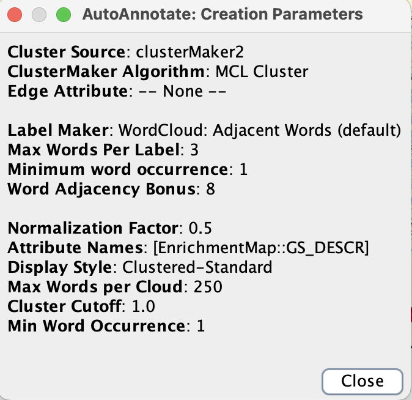

# Introduction
The dataset used in this study is obtained from a study performed by DeLange et al., 2023. The dataset is titled "transcriptomic profileing of iPSC-derived engineered cardiac tissue in which cMyBP-C have been ablated in the heterozygous and homozygous states on an isogenic background." The authors wanted to examin the effects of heterozygous (cMyBP-C+/-) and homozygous (cMyBP-C-/-) truncation mutations in the cardiac myosin binding protein C (cMyBP-C) gene on the development of hypertrophic cardiomyopathy (HCM) through the use of human induced pluripotent stem cells (hiPSCs). They achieved their ablation using the CRISPR-Cas9 technology [@de2023cmybp].

However, we previously found that from looking at the level of similarity and clustering of the samples using a multidimensional scaling (MDS) plot, it appeared that there isn’t much separation between the cMyBP-C+/+ (wild-type) and cMyBP-C+/− (heterozygous mutant) dataset. Thus, we excluded the heterozygous dataset and simply focusing on comparing the cMyBP-C+/+ (wild-type) and cMyBP-C-/− (homozygous mutant) datasets.


*Figure 1: Multidimensional scaling (MDS) plot depicting the gene expression profiles across different genotypes of cMyBP-C. Each point represents a sample, with blue denoting the wild-type cMyBP-C+/+, grey the heterozygous mutant cMyBP-C+/-, and red the homozygous mutant cMyBP-C-/-. The axes represent the leading log fold changes (logFC) dimensions 1 and 2, which account for 41% and 25.9% of the variance, respectively.*

## Retrieving and Processing Data
We can start by first importing the following packages from r to be used in this section: GEOquery [@davis2007geoquery], knitr [@xie2017dynamic], dplyr [@wickham2014dplyr], edgeR [@robinson2010edger], BiomaRt [@smedley2009biomart].

```{r results='hide', error=FALSE, message=FALSE, warning=FALSE}
library(GEOquery)
library(knitr)
library(dplyr)
library(edgeR)
library(biomaRt)
```

Let's retrive the dataset from Gene Expression Omnibus (GEO). This dataset's GEO accession number is **GSE224129**. We'll also remove the heterozygous samples and rename the columns so we can read the table better. Here's the processed data:

```{r echo=FALSE, error=FALSE, message=FALSE, warning=FALSE}
#Getting the GEO accession data
data_set_geoid <- "GSE224129"
gse <- getGEO(data_set_geoid, GSEMatrix=FALSE)

#Retrieve the metadata for the first GEO Platform ID extracted from the GEO series.
current_gpl <- names(GPLList(gse)) [1]
current_gpl_info <- Meta(getGEO(current_gpl))

#getting the the supplementary files
sfilenames = getGEOSuppFiles(data_set_geoid, fetch_files = FALSE)
data_filename <- sfilenames$fname[1]

#Download the expression data if haven't download them yet
#location to download and store files
download_dir <- file.path(getwd())

#check to see if the file exists already before you download them
#only download files that we don't have from the set of supplementary files
missing_files <- sfilenames$fname[!unlist(lapply(sfilenames$fname, FUN=function(x) {
  file.exists((
    file.path(download_dir, data_set_geoid, x)))}))]

if(length(missing_files) > 0){
  for(i in 1:length(missing_files)){
    #get the supplementary files
    sfiles = getGEOSuppFiles(data_set_geoid, filter_regex = missing_files[i], baseDir = download_dir, fetch_files = TRUE)
  }
}

homo_hetero_wt_data <- read.table (
  file.path(download_dir, data_set_geoid, data_filename), header = TRUE, check.names = TRUE)

#Remove the four heterozygous columns
homo_hetero_wt_data$X2.0020807E7 <- NULL 
homo_hetero_wt_data$X2.0020809E7 <- NULL
homo_hetero_wt_data$X2.0020811E7 <- NULL
homo_hetero_wt_data$X2.002081E7 <- NULL

#Rename the column names
renamed_col <- colnames(homo_hetero_wt_data) <- c("homo_mutant_1", "homo_mutant_2", "homo_mutant_3", "homo_mutant_4", "wild_type_1", "wild_type_2", "wild_type_3", "wild_type_4")
kable(homo_hetero_wt_data[1:6, 1:8], type = "html")
```

## Biological Overview
As with the previous assignments, we can look at the biological overview of the samples used in the study. We also want to isolate the samples relevant to our analysis here, which is the wild-type and homozygous mutant only. This step will be relevant for our analysis later, when we want to isolate our top hits only. For now, the following code chunks will do the job:

```{r echo=FALSE, error=FALSE, message=FALSE, warning=FALSE}
#Extract the list of samples from the GEO series object
list_of_samples <- gse@gsms

#Consolidate the sample information into a single dataframe
samples_type <- do.call(rbind, 
                       lapply(list_of_samples, 
                              FUN=function(x) {
                                c(x@header$title,
                                  x@header$characteristics_ch1)
                                  }
                              )
                       )

#Set the column names for the new datafram
colnames(samples_type) <- c("title", "tissue", "cell line", "cell type", "genotype", "treatment", "sex")

#Cleaning up the columns
samples_type[, 'tissue'] <- gsub(samples_type[, 'tissue'], pattern = "tissue: ", replacement = "")
samples_type[, 'cell line'] <- gsub(samples_type[, 'cell line'], pattern = "cell line: ", replacement = "")
samples_type[, 'cell type'] <- gsub(samples_type[, 'cell type'], pattern = "cell type: ", replacement = "")
samples_type[, 'genotype'] <- gsub(samples_type[, 'genotype'], pattern = "genotype: ", replacement = "")
samples_type[, 'treatment'] <- gsub(samples_type[, 'treatment'], pattern = "treatment: ", replacement = "")
samples_type[, 'sex'] <- gsub(samples_type[, 'sex'], pattern = "sex: ", replacement = "")

#removing 4 heterozygous samples
sample_type_dt <- data.table::data.table(samples_type)
sample_type_dt <- sample_type_dt[sample_type_dt$title != "cMyBP-C+/- ECT 1 [s20020807E7]", ]
sample_type_dt <- sample_type_dt[sample_type_dt$title != "cMyBP-C+/- ECT 2 [s20020809E7]", ]
sample_type_dt <- sample_type_dt[sample_type_dt$title != "cMyBP-C+/- ECT 3 [s20020811E7]", ]
sample_type_dt <- sample_type_dt[sample_type_dt$title != "cMyBP-C+/- ECT 4 [s2002081E7]", ]

#visualizing our sample type data
kable(sample_type_dt, type="html")
```

## Normalize dataset and Mapping to HGNC symbol
Finally, we can filter and normalize our selected dataset for our subsequent analysis.The normalization method used is the Trimmed Mean of M-values (TMM). We'll also map the Ensembl gene ids to its HUGO gene symbol. Here is our final dataset.

```{r echo=FALSE, error=FALSE, message=FALSE, warning=FALSE}
#Filter the data
#Setting the minimal number of samples to 4, which is the number of samples for each genotype in the study
min_num_samples <- 4

data_matrix <- as.matrix(homo_hetero_wt_data)

#get rid of low counts
keep = rowSums(cpm(data_matrix) >1) > min_num_samples
filtered_data_matrix = data_matrix[keep,]

#Normalize the dataset
#Create an edgeR container for RNAseq count data
d = DGEList(counts=filtered_data_matrix, group=sample_type_dt$genotype)

# Calculate the normalization factors
d = calcNormFactors(d)

#Compute counts-per-million (CPM) to obtain the normalized counts
normalized_counts <- cpm(d)

#Map the dataset to its HGNC symbols
#Initialize the use of the ENSEMBL BioMart database, specify for 'homo sapiens'
ensembl <- useMart("ensembl")
ensembl = useDataset("hsapiens_gene_ensembl",mart=ensembl)
```

```{r echo=FALSE, error=FALSE, message=FALSE, warning=FALSE}
#Create a vector of ENSEMBL gene IDs to convert to HGNC symbols
ids2convert <- rownames(normalized_counts)

#check to see if id_conversion file exists (computationally intensive)
conversion_stash <- "id_conversion.rds"
if(file.exists(conversion_stash)){
  id_conversion <- readRDS(conversion_stash)
}  else {
   id_conversion <- getBM(attributes = 
c("ensembl_gene_id","hgnc_symbol"),
                            filters = c("ensembl_gene_id"),
                            values = ids2convert,
                            mart = ensembl)
   saveRDS(id_conversion, conversion_stash)
}
```

```{r echo=FALSE, error=FALSE, message=FALSE, warning=FALSE}
#Merge the normalized count data with the gene symbol conversion table to annotate the rows with HGNC symbols
normalized_counts_annot <- merge(id_conversion, normalized_counts,
                                 by.x = 1, by.y = 0, all.y = TRUE)

#Visualize the normalized annotated counts data
kable(normalized_counts_annot[1:5,1:10], type="html")
```

## Differential Expression Analysis
To generate the files that we'll need for our gene set enrichment analysis (GSEA), we first need to perform a differential expression analysis as in Assignment 2. Performing this method will allow us to generate the differentially expressed genes from all our list of genes, which will then be subjected to the GSEA.

We first create a model matrix. This matrix serves as a blueprint for our statistical model, describing how we group our samples according to their genotypes.

```{r echo=FALSE, error=FALSE, message=FALSE, warning=FALSE}
#Construct a model matrix for the experimental design based on the genotype
model_design <- model.matrix(~sample_type_dt$genotype)
model_design[1:8, ]
```

Next, to really identify that differential expression between the genes in both genotype, we'll perform the Quasi Liklihood test. As specified in Assignment 2 previously, in this method, we'll also perform a multiple hypothesis correction using the BH method.

```{r echo=FALSE, error=FALSE, message=FALSE, warning=FALSE}
#Create a DGEList object for differential expression analysis
d = DGEList(counts=filtered_data_matrix, group=sample_type_dt$genotype)

#Estimate the dispersion of counts to inform the statistical model given our model design
d <- estimateDisp(d, model_design)

#Fit a generalized linear model using the Quasi Likelihood method
fit <- glmQLFit(d, model_design)

#Perform a quasi-likelihood F-test to assess differential expression and use the BH correction method
qlf.hetero_vs_homo <- glmQLFTest(fit, coef='sample_type_dt$genotypecMyBP-C+/+')
kable(topTags(qlf.hetero_vs_homo), type="html", row.names = TRUE)

#Retrieve all differential expression results, sorted by p-value
qlf_output_hits <- topTags(qlf.hetero_vs_homo,
                           sort.by = "PValue",
                           n = nrow (normalized_counts))
```

# Non-thresholded Over Representation Analysis
We can now begin to perform our non-thresholded overrepresentation analysis (ORA). However, we should first create a ranked file of the list of genes.

## Create non-thresholded list of genes
The code chunk below will create a text file of the ranked list of non-thresholded genes for an overrepresentation analysis (ORA). This ranked file will be one of the input for the upcoming pipeline, using GSEA and Cytoscape. The positive ranks are the upregulated genes while the negative ranks are the downregulated genes. 

```{r}
#merge gene names with the top hits
qlf_output_hits_withgn <- 
merge(normalized_counts_annot[,1:2],
      qlf_output_hits, by.x=1, by.y=0)

#calculate a 'rank' value for each gene
qlf_output_hits_withgn[, "rank"] <- - 
log(qlf_output_hits_withgn$FDR, base = 10) *
sign (qlf_output_hits_withgn$logFC)
qlf_output_hits_withgn <- 
qlf_output_hits_withgn[order(qlf_output_hits_withgn$rank),]

#Remove genes that don't have gene symbols
qlf_output_hits_withgn <- 
qlf_output_hits_withgn[qlf_output_hits_withgn$hgnc_symbol != "",]
```

```{r}

#write the filtered and logfc gene list to a text file
write.table(x=data.frame(genename=
qlf_output_hits_withgn$hgnc_symbol,
                        F_stat = qlf_output_hits_withgn$logFC),

file = file.path(getwd(), "mutant_vs_wildtype_logfc_genelist.txt"),
        sep = "\t", row.names = FALSE,
        col.names = FALSE, quote = FALSE)
```

```{r}

#write the filtered and PValue gene list to a text file
write.table(x=data.frame(genename=
qlf_output_hits_withgn$hgnc_symbol,
                        F_stat = qlf_output_hits_withgn$PValue),

file = file.path(getwd(), "mutant_vs_wildtype_pvalue_genelist.txt"),
        sep = "\t", row.names = FALSE,
        col.names = FALSE, quote = FALSE)
```

```{r}

#write the filtered and ranked gene list to a text file
write.table(x=data.frame(genename=
qlf_output_hits_withgn$hgnc_symbol,
                        F_stat = qlf_output_hits_withgn$rank),

file = file.path(getwd(), "mutant_vs_wildtype_ranked_genelist.txt"),
        sep = "\t", row.names = FALSE,
        col.names = FALSE, quote = FALSE)

```

# GSEA
After we obtain the ranked list of genes, we can proceed to perform the non-thresholded gene set enrichment analysis. When compared to the thresholded gene set enrichment analysis, we are concerned with the genes that may not exactly be upregulated or downregulated, but may be working together with the other genes that are upregulated or downregulated in a certain pathway/process. 

**What method did you use?**

The method we'll use here is GSEA (Gene Set Enrichment Analysis). GSEA is a robust method used to associate a disease phenotype to a group of genes or proteins (in our case, genes), providing insight into complex biological processes. It works by utilizing the quantitative expression data to pinpoint groups of genes that are significantly involved in certain biological functions or diseases, indicating on how these genes might influence the condition being studied [@zito2021gene]. 

**What gene sets did you use? Which version?**

The gene sets that we use for our analysis here is obtained from the Baderlab gene set. Their gene set is chose as it is compiled and updated monthly. It consists of gene sets from Gene Ontology (released monthly), pathway databases (Humancyc, Msigdb, NCI_Nature, Netpath, Panther, Reactome, and Wikipathways), Human phenotype, drugbank, miRS, and transcriptome gene sets. With an extensive collection of gene sets and regular updates, their gene sets are robust.

The version of the gene set is the ones from March 1, 2024. Specifically, we use the Human GOBP, all pathways without PFOCR, and without inferring from electronic annotation (IEA). However, it is modified further on March 19, 2024. Below is the link to download the gene set we used from Baderlab:

[Human_GOBP_AllPathways_noPFOCR_no_GO_iea_March_01_2024_symbol.gmt](https://download.baderlab.org/EM_Genesets/current_release/Human/symbol/Human_GOBP_AllPathways_noPFOCR_no_GO_iea_March_01_2024_symbol.gmt)

## GSEA parameters
Using the above files (ranked list of genes and the baderlab gene set), we run them in GSEA using the following parameters:


*Figure 2. GSEA parameters used in our non-thresholded gene set enrichment analysis*

The number of permutations is set to 1000 as we believe it will provide a great balance of computational efficiency and reliability of the resulting enrichment scores. The permutation in GSEA is done to create a null distribution for the enrichment score (ES). Having this null distribution will aid in calculating the p-value in estimating the significance of an observed ES, ensuring the observed findings are not by chance. Here, 1000 permutation is the number of times that the gene sets will be randomized in order to create a null distribution to calculate the FDR. Thus, Using this high number would allow for a more accurate estimation of the null distribution for statistical significance.

The maximum size of the gene set is set to 200 genes to ensure we get a smaller but meaningful result. 

The minimum size of the gene set is set to 10 genes to ensure that the sets are sufficiently broad to be relevant while still being specific enough to provide meaningful insights.

Here is another picture of the complete parameters used in my GSEA analysis:


*Figure 3. Complete GSEA parameters used in our non-thresholded gene set enrichment analysis*

## Enrichment Results Summary

**Summarizing the enrichment results**

After running GSEA with those parameters and our ranked list of genes, containing 12345 genes, we obtained a total of 6718 gene sets, where 3194 are upregulated in the positive phenotype, meaning that they are upregulated in the homozygous mutant samples compared to the wild-type samples/controls. 

The remaining 3524 gene sets are upregulated in the negative phenotype, meaning that they are downregulated in the homozygous mutant samples compared to the wild-type samples/controls.

The figure below shows the GSEA report overview screenshot:


*Figure 4. GSEA report overview showing the upregulated gene set summary (na_pos phenotype) and downregulated gene set summary (na_neg phenotype). The summary highlights the number of gene sets in each categories and further specifying the number of significant ones that passes the FDR (<25%) and P-Value threshold (<5% and <1%).*

### Upregulated gene sets

The picture below further zooms into the upregulated gene sets overview from Figure 4 above:


*Figure 5. GSEA report overview for the positive phenotype (upregulated gene sets) highlighting the number of gene sets and those that are significant, passing the FDR (<25%) and P-Value threshold (<5% and <1%).*

Looking at the figure above, among the 3194 upregulated gene sets, 364 of them passes the multiple hypothesis testing (FDR) when the threshold is set to 0.25. However, just looking at those that passes the P-value threshold of 0.05, there were 484 gene sets and 246 gene sets with a P-value threshold of 0.01. 

Now, let's look at the snapshot of the enrichment results in figure and table forms:


*Figure 6. Snapshot of the enrichment results from GSEA on the upregulated gene sets when comparing the homozygous mutant cMyBP-C-/- to the wild-type cMyBP-C+/+ samples. The top 9 gene sets are shown and each figure also depicts the enrichment profile and enrichment score.*


*Table 1. Table of list of gene sets upregulated from GSEA when comparing the homozygous mutant cMyBP-C-/- to the wild-type cMyBP-C+/+ samples. The top 13 gene sets are shown in each row along with their respective gene size, enrichment score (ES), normalized enrichment score (NES), p-values (NOM P-Val and FWER P-Val), q-value (FDR q-val), rank at max, and the leading edge informations.*

Looking at Figure 6 and Table 1 above, it appears that the top gene sets enriched in the comparison of the homozygous mutant cMyBP-C-/- to the wild-type cMyBP-C+/+ samples revolve primarily around cellular energy processes, with cellular respiration being on top. This is followed by other gene sets related to the citric acid (TCA) cycle, respiratory electron transport, and various aspects of oxidative phosphorylation, which include energy derivation by oxidation of organic compounds, aerobic respiration, and ATP synthesis. These processes are important components of the metabolic pathway that cells use to convert nutrients into ATP, the primary energy currency in biological systems. The enrichment of these gene sets suggests a significant upregulation of metabolic pathways involved in energy production in the homozygous mutant samples.

The similarities of the top gene sets suggest a coordinated upregulation of the entire energy production machinery in the mutant cells. This may infer that the mutant cells are experiencing higher energy demands or are compensating for a dysfunction elsewhere in the energy metabolism pathways. Notably, all these processes are interlinked; the TCA cycle provides electrons to the electron transport chain, which in turn drives ATP synthesis through oxidative phosphorylation [@alberts2002cells]. The enrichment scores (ES), normalized enrichment scores (NES), and the statistical significance of these enrichments (p-values and q-value) highlights the robustness of these findings, indicating that the changes are unlikely due to chance.

In the last column of Table 1, we can see the leading edge of geach gene set. In GSEA, the leading edge subset are the list of genes within that gene set that contribute to the enrichment and cause that gene set to be enriched. Thus, these core set of genes that contribute most to the enrichment signal and are biologically relevant. A larger leading edge can indicate a stronger association between the gene set and the phenotype. Here, it may suggest that a wider range of genes within that set are being affected by the homozygous cMyBP-C-/- mutant.

Now, we can look at the top upregulated gene set from the list above.


*Figure 7. Enrichment plot obtained through GSEA of the top upregulated gene set from comparing cMyBP-C homozygous Mutant vs. Wild-Type, Cellular Respiration Gene Set from GOBP GO number 0045333. A table summarizing the enrichment plot is included above.*

This enrichment plot represents the top gene set upregulated in the homozygous mutant cMyBP-C-/- compared to the wild-type cMyBP-C+/+ samples,  'Cellular Respiration'. The green line traces the Enrichment Score (ES), indicating the over-representation of the gene set at the top of the ranked list. The peak of the green line corresponds to the maximum ES, which is where the gene set is most significantly overrepresented. The black bars below represent the positions of genes in the Cellular Respiration gene set along the ranked list. Genes in the leading edge substet are located to the left of the ES peak and those contributing to the core enrichment are marked in red towards the left [@subramanian2005gene].

The ES of 0.6652775 and Normalized Enrichment Score (NES) of 2.7581959, combined with nominal p-value, FDR q-value, and FWER p-value all being 0.0, indicate a statistically significant enrichment of the cellular respiration gene set in the cMyBP-C mutant. This suggests that cellular respiration pathways are notably more active or prevalent in the mutant samples, potentially implicating these pathways in the biological processes affected by the cMyBP-C mutation.

### Downregulated gene sets

We can perform a similar analysis for the downregulated gene sets. Figure 8 below further zooms into the downregulated gene sets overview from Figure 4 above:


*Figure 8. GSEA report overview for the negative phenotype (downregulated gene sets) highlighting the number of gene sets and those that are significant, passing the FDR (<25%) and P-Value threshold (<5% and <1%).*

Among the 3524 downregulated gene sets, 496 of them passes the multiple hypothesis testing (FDR) with a threshold of 0.25. 645 passes the threshold of P-value less than 0.05, and only 331 gene sets passes with a with a P-value threshold of 0.01. 

Again, let's look at the snapshot of the enrichment results in figure and table forms:


*Figure 9. Snapshot of the enrichment results from GSEA on the downregulated gene sets when comparing the homozygous mutant cMyBP-C-/- to the wild-type cMyBP-C+/+ samples. The top 9 gene sets are shown and each figure also depicts the enrichment profile and enrichment score.*


*Table 2. Table of list of gene sets downregulated from GSEA when comparing the homozygous mutant cMyBP-C-/- to the wild-type cMyBP-C+/+ samples. The top 13 gene sets are shown in each row along with their respective gene size, enrichment score (ES), normalized enrichment score (NES), p-values (NOM P-Val and FWER P-Val), q-value (FDR q-val), rank at max, and the leading edge informations.*

From Figure 9 and Table 2 above, we can see that the most significantly downregulated gene sets in the homozygous mutant cMyBP-C-/- compared to the wild-type cMyBP-C+/+ samples are primarily related to structural proteins. These include those involved in the organization and biosynthesis of collagen. The gene set 'Collagen Fibril Organization' is the most affected, with gene sets associated with extracellular structure and matrix organization also being significantly downregulated. These sets play critical roles in maintaining the structural integrity of tissues and facilitating cell-to-cell communication. The downregulation of these pathways could suggest a potential disruption in connective tissue integrity or altered extracellular matrix interactions in the mutant cells. Related gene sets are also seen to be downregulated, highlighting the broad impairment in processes involving the extracellular matrix and collagen synthesis. This downregulation may reflect structural or regulatory changes within the cells that impact their extracellular environment. 

Like in the upregulated gene set figures, the leading edge analysis identifies a significant proportion of genes within these gene sets contributing to the negative enrichment. Furthermore, the enrichment scores (ES) and normalized enrichment scores (NES) across these sets also confirm the significance of the suppression of these gene functions in the mutant samples. The statistical confidence in these results, supported by low p-values and FDR q-values, suggest that these observed differences are reflective of a biologically relevant change in the mutants' cellular environment.

Finally, we can again look at the top downregulated gene set from the above list, which is the collagen fibril organization gene set from GO biological pathways.


*Figure 10. Enrichment plot obtained through GSEA of the top downregulated gene set from comparing cMyBP-C homozygous Mutant vs. Wild-Type, Collagen Fibril Organization Gene Set from GOBP GO number 0030199 A table summarizing the enrichment plot is included above.*

Figure 10 shows the enrichment results for the 'Collagen Fibril Organization' gene set, which is significantly downregulated in cMyBP-C homozygous mutant (cMyBP-C-/-) compared to the wild-type (cMyBP-C+/+). Like the upregulated figures, the green line represents the Enrichment Score (ES) as the analysis moves down the ranked list of genes. The sharp decline in the ES, reaching a trough indicates a strong enrichment among the genes that are downregulated in the mutant phenotype. The magnitude of the ES, which in this case is negative (-0.7349785), indicates that the genes within the 'Collagen Fibril Organization' set tend to be ranked lower, implying they are less expressed in the mutant samples compared to the wild-type. 

The table above the plot also provide a great quantitative summary of the GSEA results for this gene set and they confirm the significance of the observed downregulation. The Normalized Enrichment Score (NES) of -2.3411288 confirms the downregulation in the context of the entire gene list. The nominal p-value and false discovery rate (FDR) q-value at 0.0, along with a family-wise error rate (FWER) p-value also at 0.0, depicts the statistical robustness of the enrichment, confirming that the downregulation is not due to random variation. 

The histogram below the enrichment score curve marks the position of each gene in the 'Collagen Fibril Organization' set within the ranked list. The blue bars highlight the leading edge subset of genes, especially to the right of the negative ES peak, which are the genes that most heavily contributes to the enrichment signal. Being in the leading edge means that they might be driving the biological differences observed between the cMyBP-C-/- mutants and wild-type samples. This suggests that change in collagen fibril organization may be an important aspect of the molecular phenotype of the cMyBP-C homozygous mutation, potentially impacting tissue structure and function [@subramanian2005gene].

# Non-thresholded VS Thresholded ORA

Now that we have our non-thresholded ORA result using GSEA, we can compare them to see how they differ with the thresholded ORA result using G:profiler from Assignment 2.

## Recap of Thresholded ORA G:Profiler result

Using G:Profiler, for the upregulated genes, we obtained a total of 318 GO:Biological Processes, 24 Reactome pathways, and 30 WikiPathways gene sets that are significantly enriched. A snapshot of the result is depicted in the figures below.

Here's the overview of the overall gene sets enriched in the upregulated genes from G:Profiler:


*Figure 11. Table of enriched Gene Ontology Biological Process and biological pathway terms from the upregulated genes in the comparison between wild-type and homozygous mutant cMyBP-C genes generated through G:Profiler. Columns show the term name, term ID, and the corresponding adjusted p-values (padj).*

Here is a more specific snapshot of the gene sets from each of the three pathways:


*Figure 12. Table of the top Gene Ontology Biological Process (GO:BP), Reactome, WikiPathways terms enriched in upregulated genes from a comparison of wild-type and homozygous mutant cMyBP-C using G:Profiler. The terms are listed alongside their unique identifiers (Term ID) and the adjusted p-values (padj). Highlighted terms suggest unique biological processes that are most likely to be related to hypertrophic cardiomyopathy and affected by the cMyBP-C mutation.*

For the downregulated genes, we obtained a total of 283 GO:Biological Processes, 133 Reactome pathways, and 55 WikiPathways gene sets that are significantly enriched. A snapshot of the result is depicted in the figures below.

Here's the overview of the overall gene sets enriched in the downregulated genes from G:Profiler:


*Figure 13. Table of enriched Gene Ontology Biological Process and biological pathway terms from the downregulated genes in the comparison between wild-type and homozygous mutant cMyBP-C genes generated through G:Profiler. Columns show the term name, term ID, and the corresponding adjusted p-values (padj).*

And here is a more specific snapshot of the gene sets from each of the three pathways:


*Figure 14. Table of the top Gene Ontology Biological Process (GO:BP), Reactome, WikiPathways terms enriched in downregulated genes from a comparison of wild-type and homozygous mutant cMyBP-C using G:Profiler. The terms are listed alongside their unique identifiers (Term ID) and the adjusted p-values (padj). Highlighted terms suggest unique biological processes that are most likely to be related to hypertrophic cardiomyopathy and affected by the cMyBP-C mutation.*

## Comparison 

**How do these results compare to the results from the thresholded analysis in Assignment 2?**

Looking at the results from the GSEA with the thresholded analysis obtained from g:Profiler, we can immediately see that there is a difference in the number of gene set outputs. Using GSEA, 3524 out of 6718 gene sets are upregulated, and 3194 are downregulated in the study's experiment. In contrast, g:Profiler results show 318 GO: Biological Processes, 24 Reactome pathways, and 30 WikiPathways gene sets enriched among upregulated genes, while 283 GO: Biological Processes, 133 Reactome pathways, and 55 WikiPathways gene sets are enriched among downregulated genes.

The primary reason for this discrepancy is because GSEA assesses gene sets as a whole, taking into account the ranked list of all genes based on their expression changes, without the use of any cutoff for inclusion. Therefore, even genes with subtle expression differences that might be missed with a strict cutoff may be included using GSEA and can contribute to the enrichment score of a gene set. This makes GSEA particularly useful when we are interested in the collective behavior of genes within a pathway and not simply the impact of highly differential genes.

In comparison, G:Profiler only analyze genes that surpass a certain threshold for expression changes. We specified those threshold as being <0.05 FDR. It identifies enriched pathways based on these genes, potentially missing out on subtler, yet biologically significant, changes. Hence, the fewer gene set results.

However, the top gene sets obtained from both methods reveal a similar process and pathways being affected by the cMyBP-C mutations as we see qualitatively. 

For the upregulated gene sets, GSEA results showed an enrichment in pathways related to energy metabolism, such as cellular respiration and the TCA cycle, indicating a systemic upregulation of the energy production pathways. This finding is mirrored in the G:Profiler results, which also list metabolic processes, especially those related to energy derivation and respiratory electron transport chains.

In the downregulated gene sets, GSEA highlighted a significant downregulation in gene sets associated with collagen, extracellular matrix, and structural integrity, indicating an alteration in structural protein organization. The G:Profiler results also show downregulation in processes related to collagen and extracellular structures, confirming the trends seen in GSEA.

However, as I mentioned earlier, the methodologies used for enrichment analysis using GSEA and G:Profiler is different. Thus, their comparison isn't straightforward. GSEA considers the entire dataset, which allows it to detect coordinated changes across all genes. In contrast, G:Profiler, being threshold-dependent, might not detect subtle changes in gene expression if individual genes do not meet the threshold criteria.

Therefore, while there is qualitative similarities between the two methods regarding the biological processes affected, their results might not be directly comparable due to methodological differences. Regarless, both analyses give complementary insights into the biological changes occurring in the cMyBP-C homozygous mutants.


# Cytoscape Visualization

Using your results from the non-thresholded gene set enrichment analysis, we can visualize them in Cytoscape by creating an enrichment map [@isserlinenrichment]. 

## Initial Enrichment Map

**How many nodes and how many edges in the resulting map?**

There are 38 nodes and 396 edges in the resulting enrichment map.


*Figure 15. GSEA enrichment map of mutant vs wildtyped cMyBP-C indicating the nodes (38) and edges (396).*

**What thresholds were used to create this map?** 

The parameters used to create this map is shown in Figure 16 below. The cut-off values we choose was a P-value of 1.0, FDR Q-value of 0.0001 and the edges, which are the similarity between the two gene sets/pathways, were calculated using the combined Jaccard coefficient and Overlap method has a cutoff value of 0.375. 

The data sets we uploaded to create the enrichment map were the gene sets file from the Baderlab gene set version March 1, 2024, which is the same one we used for our GSEA analysis earlier. That is the Human GOBP, all pathways without PFOCR, and without inferring from electronic annotation (IEA). However, it is modified further on March 19, 2024. 

Again, below is the link to download the gene set we used from Baderlab:

[Human_GOBP_AllPathways_noPFOCR_no_GO_iea_March_01_2024_symbol.gmt](https://download.baderlab.org/EM_Genesets/current_release/Human/symbol/Human_GOBP_AllPathways_noPFOCR_no_GO_iea_March_01_2024_symbol.gmt)

We also included the two reports from the positive and negative phenotype that was created from running the GSEA analysis earlier and also included the ranked gene list file that was made earlier in the **Create non-thresholded list of genes** section.

We also specified that the positive phenotypes from GSEA are the upregulated gene sets and the negative phenotypes are the downregulated gene sets.


*Figure 16. GSEA enrichment map creation parameters indicating the various cut-off values and data sets used in Cytoscape.*

**How is the network prior to manual layout?**

Here is a figure of the network before any manual layout is performed


*Figure 17. Enrichment map of the upregulated (red) and downregulated (blue) gene sets comparing the  wild-type and homozygous mutant cMyBP-C genes created using Cytoscape from the GSEA gene set results before any manual layout.*

Looking at Figure 17 above, we can immediately see that there are a lot of upregulated gene sets that passes the threshold cut off parameters set earlier. They also appeared to form two prominent clusters. In contrast, there is only one blue node - one downregulated gene set.  The upregulated clusters suggest a focus on related biological themes, and they seem to be associated with metabolic and mitochondrial activity, while the single downregulated node suggest a distinct pathway with less activity.

In enrichment map, the thickness of the edges (lines between the nodes) should indicate the degree of overlap between the nodes that they are connecting. However, as the initial map above seemed to compact, it is hard to see that difference, and some manual layout to expand those clusters are needed to have a better visualization.

## Annotated Network

**What parameters did you use to annotate the network?**

After performing the manual layout expanding the clusters, we also annotate them using the AutoAnnotate application within Cytoscape [@kucera2016autoannotate]. Below is the parameters we used in annotating the enrichment map:



*Figure 18. Enrichment map AutoAnnotate creation parameters for our network in Cytoscape. These parameters are the default parameters from AutoAnnotate.*

The AutoAnnotate parameters indicate that the plugin (Cytoscape app) used is the clusterMaker2 app with the MCL (Markov Cluster Algorithm) for clustering. The WordCloud label maker is set to generate labels with up to three words based on adjacent word occurrence within the gene set descriptions, with a substantial adjacency bonus (8) to prioritize closely linked terms.

Here is what the annotated network itself looks like:


*Figure 19. Annotated and manually layed out enrichment map of the upregulated (red) and downregulated (blue) gene sets comparing the wild-type and homozygous mutant cMyBP-C genes created using Cytoscape and annotated using AutoAnnotate. The beige circles indicate a themed cluster of the gene set members.*

After annotating the enrichment network, we are able to clearly see themes of the enriched biological process in the mutant cMyBP-C samples compared to the healthy wild types. There are two themes generated from the auto annotation process. The larger cluster of the upregulated gene sets, labelled  "process electron transport," contain 31 gene sets associated with mitochondrial energy metabolism, such as ATP biosynthetic and metabolic process, electron transport, oxidative phosphorylation, and nucleoside triphosphate metabolic processes. There is also another smaller cluster of the upregulated gene sets labelled as "myofibril involved morphogenesis." This cluster has 3 gene sets associated with it, which are related to myofibril assembly and muscle development. 

There are four nodes remaining that are not part of a cluster, with only one of them being downregulated in the mutant samples (blue), which is the "collagen fibril organization" gene set. This signify that there is a downregulated activity in collagen organization processes. 

Another benefit of laying out those nodes and expanding them is also the ability to nicely distinguish the size of the nodes and edges. Here, we have set the size of the nodes to reflect the number of genes associated with the gene set. Thus, larger nodes means that it has more genes associated with it. 

Similarly, the size of edges are also informative. It tells us the similarity coefficient between the two nodes/gene sets it connects. This similarity coefficient is calculated using the Jaccard and Overlap method earlier used in the creation parameter of the enrichment map. Two nodes with a lot similar genes will result in a higher similarity coefficient, resulting in a thicker edge.

Lastly, having the nodes spread out further can allow us to nicely appreciate the interconnectedness of the nodes. Although the cluster shown in Figure 19 is still complex, we can better see which gene sets are similar with the other gene sets compared to the initial clumped enrichment map on Figure 17.

## Publication Ready Figure

**Make a publication ready figure**

Here is what the annotated network would look like in a publication ready figure with an appropriate legend included. The legend is obtained from the [Baderlab template legend](https://baderlab.org/Software/EnrichmentMap#Legends).


*Figure 20. Enrichment Map of Gene Set Clusters in cMyBP-C Mutant vs. Wild-Type. This map visualizes the gene set clusters related to electron transport and myofibril morphogenesis, where node size represents the number of genes in each pathway, and node color indicates the enrichment score, with red for upregulated and blue for downregulated gene sets. Edge thickness reflects the size of gene overlap between connected sets, emphasizing the interconnectedness of the various processes.*

## Collapsed Themed Network

**Collapse your network to a theme network. What are the major themes present in this analysis? Do they fit with the model? Are there any novel pathways or themes?**

Cytoscape also allows us to collapse the themes into a single node for a better visualization in certain cases. Collapsing the network would reduce the large clusters of related gene sets into a single node representing their collective themes. In our enrichment map, it will result in only 6 nodes being present as shown in Figure 19 below.


*Figure 21. Collapsed Network of Major Biological Themes in cMyBP-C Mutant vs. Wild-Type Analysis.*

By collapsing the network, we are able to see the major themes from the analysis of cMyBP-C mutant versus wild-type, which are those we identified earlier: 'process electron transport' and 'myofibril involved morphogenesis.' Both themes align with the known functions of cMyBP-C in cardiac muscle contraction and energy metabolism [@moss2015cardiac]. The theme of 'process electron transport' corresponds to mitochondrial activities crucial for cellular energy production, while 'myofibril involved morphogenesis' reflects processes related to muscle structure and development. 

Additionally, there are the isolated nodes, which we also previously have seen. The nodes labelled 'protein refolding,' 'skeletal muscle tissue development,' and 'mitochondrial protein degradation' gene sets that are also upregulated but not part of the two themes above. While the 'skeletal muscle tissue development' gene set do not appear to share any genes with the other upregulated gene sets, it arguably fit with the model, especially the 'myofibril tissue morphogenesis' theme that has gene sets like striated muscle development.

However, the remaining two upregulated and isolated gene set 'protein refolding' and 'mitochondrial protein degradation' does not appear to be related with the other themes in the analysis. Hence, they may be considered as a new pathway/theme in in cMyBP-C gene in the context of its homozygous mutation in comparison to the wild type. We can infer their roles further, which we'll do in the Interpretation section later.

We again see the one downregulated gene set in blue, 'Collagen fibril organization.' While it stands alone, it fits with the known model of cMyBP-C gene and their mutations. This is because their dysregulation can lead to alterations in the structural integrity of the heart, affecting its mechanical properties and leading to fibrosis. This finding is consistent with the development of HCM, which is the condition being studied with their analysis comparing the mutant and wild type cMyBP-C gene. Consequently, the accumulation of fibrotic tissue contributes to the stiffening of the cardiac muscle, impairing its contractile function and leading to heart failure [@gong2023identification].

Therefore, while some of the themes collectively support the model of cMyBP-C involvement in muscular and mitochondrial function, we also see the presence of a possibly novel aspect related to protein refolding degradation could open new avenues for further research into the structural implications of the cMyBP-C mutation.

# Interpretation and Detailed View of Results

**Do the enrichment results support conclusions or mechanism discussed in the original paper?**

Our enrichment results do support for the conclusions and mechanisms discussed in the original paper by De Lange et al. In the paper, the authors found that truncation mutations in cMyBP-C led to progressive Ca2+-handling abnormalities. Specifically, the homozygous mutants (cMyBP-C-/-) showed increased strain with normal Ca2+ handling initially, but over time, there was a marked decline in contractile function with impaired Ca2+ handling. RNA-seq analysis revealed differential expression in genes associated with hypertrophic, sarcomeric, and Ca2+ handling pathways [@de2023cmybp].

As they discussed, cMyBP-C plays a role in myocardial energy production and metabolic stress where their ablation leads to metabolic stress. This is supported by the upregulated gene set clusters from our enrichment results, which highlights genes involved in substrate transport, glycolysis, and fatty acid oxidation. This include gene sets in metabolic pathways and energy production like 'electron transport' and 'myofibril morphogenesis' for muscle development. These gene sets can be upregulated due as a response to the increased ATP demand due to the mutation [@de2023cmybp].

The original paper does not explicitly address the organization of collagen fibrils, but it discusses the significance of the extracellular matrix (ECM) in the structural and functional integrity of cardiac tissues, especially facilitating cardiomyocyte contractility and its remodeling by cardiac fibroblasts. Thus, collagen, produced by the fibroblast and a primary ECM component, is vital to cardiac tissue structure and function [@de2023cmybp]. 

Therefore, the downregulated 'collagen fibril organization' gene set identified in the GSEA aligns with the paper’s emphasis on ECM, suggesting that disruptions in collagen organization due to the cMyBP-C mutation could impact the mechanical properties and signal transduction within the heart, potentially contributing to the pathological features observed in hypertrophic cardiomyopathy (HCM).

The two new themes we identified earlier ('protein refolding' and 'mitochondrial protein degradation') in the cytoscape network that were not fully explored in the paper might suggest additional mechanisms of disease progression or compensation in the mutant samples. Proteins that are not folded properly can lead to cellular dysfunction and are targeted for degradation to prevent accumulation of non-functional proteins which can be toxic. The increase in 'mitochondrial protein degradation' suggests a heightened mitochondrial quality control, likely to compensate for dysfunctional proteins that impair cellular energy functions.

I think 'protein refolding' is a particularly interesting theme because it indicates an attempt by the cell to salvage misfolded proteins, which could be a direct result of the mutant cMyBP-C. Misfolded proteins can aggregate and impair cellular function, so upregulation of refolding pathways might reflect a protective response against this. The cMyBP-C mutation cause misfolded proteins that are recognized and processed by the cell's quality control systems.

Overall, the the enrichment results do support the conclusions and mechanism discussed in the original paper.

**How do these results differ from the results you got from Assignment #2 thresholded methods?**

The results from our enrichment analysis are generally similar to the A2 thresholded methods results. In both methods, we observe upregulated gene sets related to cardiac muscle function, such as those involved in myofibril assembly, muscle tissue development, and muscle system processes. This reflects the known functions of cMyBP-C and its association with cardiac physiology and hypertrophic cardiomyopathy (HCM). Downregulated pathways in both analyses similarly suggest alterations in ECM organization and cytoskeleton structure, which are essential in the context of cardiac tissue integrity and function.

However, as previously specified in the [comparison](#comparison) section, the results using non-thresholded gene set enrichment analysis compared to those using the thresholded method are different such that in GSEA/Cytoscape network analysis, we are able to have a holistic view of the interconnectedness between pathways using all the genes without any threshold of expression change, which methods like G:Profiler focuses on. The enrichment map/network results also offer insights into the broader biological processes that are co-regulated, which are gene sets that share similar groups of genes. Such similarity can be nicely visualized through the edges that connect those pathways in the enrichment network we created for this assignment. This provides a more comprehensive picture of the mutation’s impact, which is lacking in A2 thresholded results. In other words, the clustering approach of the enrichment map may bring forth new relationships between gene sets that share overlapping genes, which might not be as apparent in the thresholded g:Profiler results.

Although, it is possible to generate an enrichment network using the A2 thresholded method results. Performing such an analysis would better compare the results obtained from the GSEA enrichment network.

Focusing on the downregulated gene sets, we also see much fewer of these downregulated pathways compared to our results from the thresholded analysis. We previously also found other downregulated gene sets, including angiogenesis and circulatory system development, which are absent in our enrichment network. One reason might be that these pathways become less relevant when we consider the entire data set genes, not just those that pass the threshold in our thresholded analysis. Our creation parameters for the enrichment map might then eliminate these potential nodes.

Finally, a significant difference is on the stand alone nodes that reveal a new theme in our enrichment map analysis ('protein refolding' and 'mitochondrial protein degradation'). These gene sets are not present in the thresholded results from G:Profiler in A2. One explanation to it might be again due to the difference in how GSEA (non-thresholded method) assesses the data set compared to G:Profiler (thresholded method) discussed earlier in the [comparison](#comparison) section. GSEA assesses genes as a whole whithout any expression cutoff for inclusion unlike G:Profiler. Thus, these two new gene sets we see in our enrichment map might have many genes with subtle expression difference that might be missed with the cutoff in the thresholded analysis. 

**Can you find evidence, i.e. publications, to support some of the results that you see. How does this evidence support your results.**

Yes, the findings from our enrichment map and network analysis from GSEA in the context of hypertrophic cardiomyopathy (HCM) are well-supported by existing literature. We saw a huge cluster of upregulated gene sets which has the theme of process electron transport. An increased activity in electron transport pathway can serve as a compensation response to the energy deficit caused by oxidative stress, mitochondiral damage, and impaired fatty acid metabolism in HCM in order to sustain its energy needs [@ranjbarvaziri2021altered].

We also observe a cluster of gene set themed myofibril involved morphogenesis, which is a hallmark of cardiac hypertrophy. In hypertrophy, there is an increase in cell size and myofibrillar remodeling is a key aspect of this process. This involves the addition of new sarcomeres, which are the contractile units of muscle fibers, and the elongation of existing myofibrils. Thus, the upregulated gene set of this cohort is a reflection of the heart muscle's efforts to adapt to increased workload, which can lead to the pathological changes seen in HCM when the stress is excessive or prolonged [@yang2016dynamic].

The single downregulated gene set observed is collagen fibril organization. In the context of HCM, the disease is characterized by the overproduction and disorganization of ECM, particularly collagen fibrils. This pathological process contributes to the thickening of the ventricular wall and the adverse remodeling that leads to heart failure in severe cases of HCM. The downregulation of the 'collagen fibril organization' gene set in the mutant cMyBP-C samples we observed aligns with these changes described in HCM. It suggests a possible reduction in the structural integrity and proper organization of collagen, which could underlie the fibrotic processes contributing to the disease pathology and the observed clinical outcomes in HCM patients [@rixon2023lumican].

We also observed the "new themes", where mitochondiral protein degradation gene set upregulation in the mutant samples is one of them. Their upregulation can be a potential compensatory response to defective mitochondrial function that arises due to the cMyBP-C mutations. Mitochondrial protein balance is know to play a critical role in cardiac health and is linked to cardiomyopathy. The observed upregulation may reflect the heart's attempt to mitigate the effects of disrupted energy metabolism and ATP production processes by enhancing the degradation and removal of malfunctioning mitochondrial proteins. This regulation is crucial for maintaining mitochondrial integrity and function during such stress [@wachoski2022mitochondrial].

The last "new theme" we discovered earlier was the upregulation of the protein remodeling gene set in the mutant samples. Research have found that there is an upregulation of heat shock proteins (HSPs) in HCM, which are crucial for protein refolding and stabilizing misfolded proteins. This upregulation may again serve as a compensatory mechanism to manage the increased burden on the protein quality control system caused by the mutant cMyBP-C. It suggests an adaptive cellular response to the stress of the cMyBP-C mutations, aiming to preserve cardiomyocyte function by enhancing the capacity for protein repair and stabilization to counteract the effects of the mutation [@dorschprotein].

# Investigating Collagen Fibril Organization Gene Set

From the above results, we can perform one final analysis, which is expanding on the single downregulated gene set in our enrichment map, collagen fibril organization. I specifically choose this gene set because it is the only downregulated pathway we observe in our analysis. In spite of that, we have concluded that their downregulation may actually play a prominent role in HCM progression, which is the reduction in the structural integrity and proper organization of collagen in patient's heart [@rixon2023lumican].

As the collagen fibril organization pathway comes from the GO Biological Process (GO:0030199), we can look at this pathway details using the GeneMANIA application within Cytoscape. GeneMANIA identifies the most related genes to a query gene set using a guilt-by-association approach. They will also connect the genes using edges that may represent various aspects of interactions, including co-expression, physical interactions, shared-protein domains, co-localization, pathway, predicted, and genetic interactions [@mostafavi2008genemania]. 

In our analysis here, we would like to focus only on the physical interactions between genes and genes that share similar pathways to be represented by the edges. We focus on the physical interaction because evaluating these genes can help us predict the impact of genetic alterations on protein-protein interactions within the collagen fibril organization pathway and we can infer the poteintial structural and functional consequences on the ECM. We also focus on similar pathway memberships because genes that physically interact or work togehter may be part of the same pathway. Doing so can further allow us to study things like pathway regulation changes due to the mutation and the functional changes as well. This may help us infer downstream effect on collagen synthesis, post-translational modification, assembly, and even the overall structural integrity of cardiac tissues in the context of HCM.

Selecting only the physical interactions and pathways represented by the edges, below is the network that we obtained.


*Figure 22. Network visualization of gene-gene interactions of the collagen fibril organization gene set in the context of comparing cMyBP-C homozygous Mutant vs. wild-type. Each node represents a gene and their size is annotated to correspond to its rank from non-thresholded ranked list of genes while their color reflects log fold expression values (red being upregulated and blue being downregulated). The edges represent either physical interactions or pathway associations.*

From the figure above, can see that the majority of the genes are downregulated, as indicated by the blue nodes. This is expected because the gene set itself is downregulated in our mutant samples. Although, there are two genes that appeared to be slightly upregulated (pink color nodes). They are the ADAMTS3 gene, which makes an enzyme that processes several types of procollagen molecules [@levy2005adamts13] and the LOXL4 gene, which codes for the lysyl oxidase like 4 protein that is involved in creating crosslinks in collagens and elastin [@gorogh2007selective]. Their upregulation may indicate the attempt to compensate for the loss of structural integrity within the ECM, suggesting for an adaptive response that could potentially mitigate the effects of disrupted collagen organization in the mutant samples.

The main network we can see here is that there are a lot of collagen-related genes (genes that starts with COL) in this gene set, which is as expected because this gene set concerns with collagen fibril organization. We have also clustered those collagen-related genes together in the middle of the network and as expected, they do share a lot of physical interactions and common pathways. Some of these collagen genes include COL1A, COL2A, COL3A, COL5A, COL11A, COL12A, and COL27A. These genes code for the collagen alpha chain types I, II, III, V, XI, XII, and XXVII, respectively, which are all part of the fibrilar collagen family [@bella2017fibrillar]. The COL11A2 gene is also the most downregulated among the genes in this pathway, indicating that this mutant phenotype may significantly affect this particular type of collagen (Collagen type 11).

Looking outside the collagen gene clusters, we also see other non-collagen genes that interact with the collagen encoding genes. This highlight the interaction between different types of genes within the cell and within a pathway. One such gene is the DDR2 gene, which encodes a member of the discoidin domain receptor subclass of the receptor tyrosine kinase (RTKs) protein family. RTKs are important in cell communication with their microenvironment, including ECM. Thus, it makes sense that this gene interacts physically with the collagen encoding genes. RTK is also a collagen-induced receptor that activates the signal transduction pathways in cell adhesion, proliferation, and ECM remodeling. As they are collagen-induced, it makes sense to see its downregulation along with the collagen gene downregulations. Moreover, since RTK plays a role in ECM remodelling, their downregulation aligns with the phenotypic characteristics of HCM that has poor ECM structure and compromised integrity [@leitinger2014discoidin]. Consequently, this downregulation could contribute to the impaired mechanotransduction observed in the hearts of individuals with HCM and described in the original study by DeLange et al., 2023.

We also observe some genes that doesn't share any physical interacton nor pathways with the other genes in this pathway. However, they do share other aspects such as co-expression and genetic interactions, which are hidden in the network above. The other edges interactions are available on my GitHub Wiki. 

By having these kinds of physical interaction analysis between the genes, researchers can identify potential therapeutic targets that could influence collagen fibril organization and restore normal tissue function in diseases where this is impaired, like HCM where the mutation of cMyBP-C is present. Understanding these interactions can also shed light on the molecular mechanisms of how mutations might lead to the observed phenotypic outcomes, such as altered tissue stiffness or fibrosis. We can also perform a similar analysis on the remaining 37 gene sets (nodes) in our enrichment map.

# References
